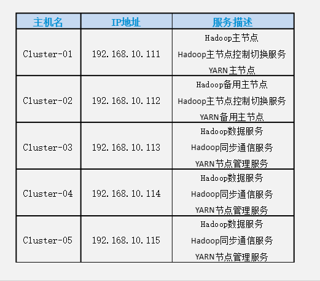


## Hadoop基本安装配置

首先，Hadoop软件包`hadoop-2.7.3.tar.gz`我们已经上传到用户家目录的`setups`目录下。然后进行解压和环境变量设置。
命令:

``` shell
mkdir ~/hadoop
#创建用于存放Hadoop相关文件的目录
cd ~/hadoop
#进入该目录
```

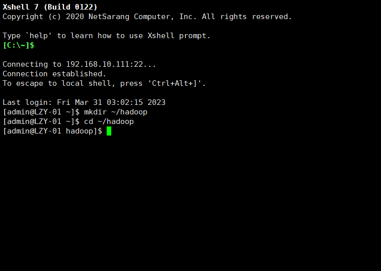

```shell
tar -xzf ~/setups/hadoop-2.7.3.tar.gz
#将软件包解压
vi ~/.bash_profile
#配置Hadoop相关的环境变量
```

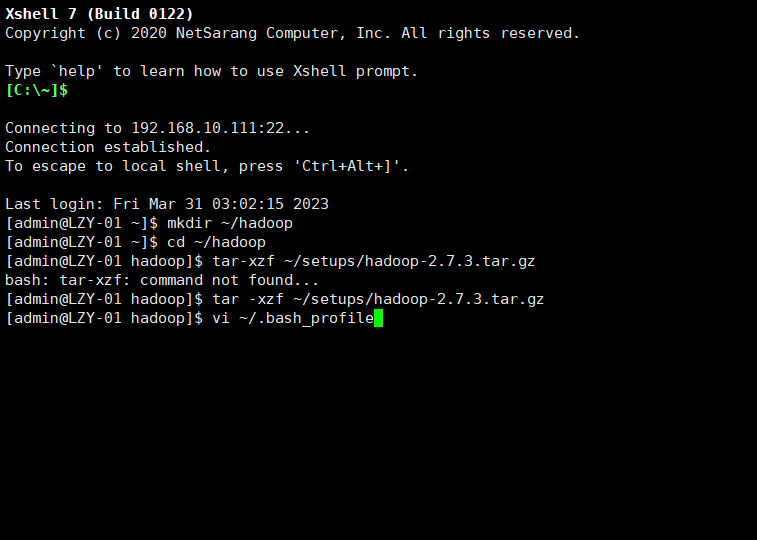

对配置文件进行修改，在文件末尾添加以下
内容:

```shell
#hadoopnvironment
HADOOP_HOME=/home/admin/hadoop/hadoop-2.7.3
#该路径以Hadoop软件包实际doop-2.7.3解压解包的路径为准

PATH=$HADOOP_HOME/bin:$HADOOP_HOME/sbin:$PATH
#确保此项输入正确，否则可能会导致所有命令无法使用

export HADOOP_HOME PATH
#必须按照前面的定义顺序书写
```

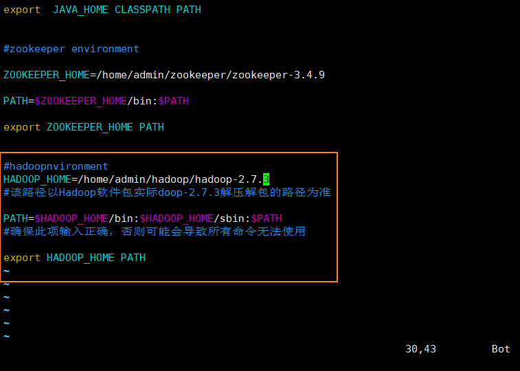

```shell
source ~/.bash_profile
#使新配置的环境变量立即生效
echo $HADOOP_HOME
#查看新添加和修改的环境变量是否
echo $PATH
#设置成功，以及环境变量的值是否正确。
hadoop version
#验证Hadoop的安装配置是否成功
```

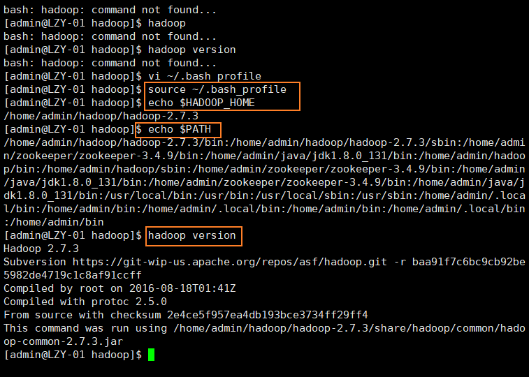


## Hadoop高可用完全分布模式配置

命令:

```shell 
cd ~/hadoop
```

进入Hadoop相关文件的目录

```shell
mkdir tmp name data journal
```

分别创建Hadoop的**临时文件**目录`tmp`、HDFS的**元数据文件**目录`name` 、HDFS的**数据文件**目录`data`. Journal的**逻辑状态数据**目录`journal`。

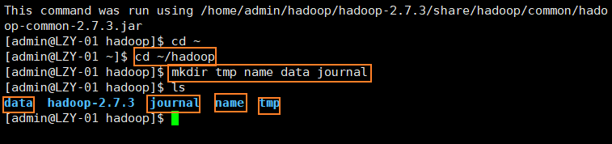

```shell
cd ~/hadoop/hadoop-2.7.3/etc/hadoop
#进入Hadoop的配置文件所在目录
vi hadoop-env.sh
#对配置文件进行修改
```

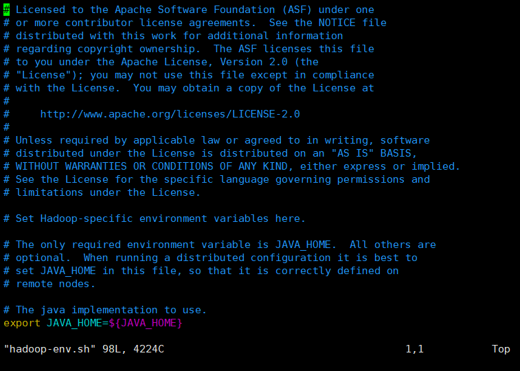

找到配置项 `JAVA_HOME` 所在行，将其改为以下内容:(去掉注释 `#` )

```shell
export JAVA_HOME=/home/admin/java/jdk1.8.0_131
#该路径以JDK软件包实际解压解包的路径为准
```

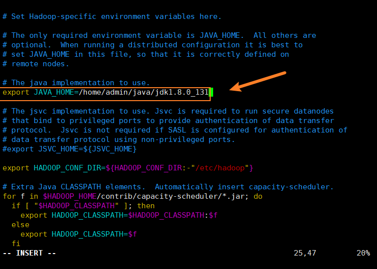
对配置文件进行修改

```shell
vi core-site.xml
```

找到标签`<configuration>`所在的位置，在其中添加如下内容:
注意修改相应的主机名为自己的姓名

```xml
<configuration>
    <property>
        <!--指定Aadoop的访问路径，需要指定为后面的HA集群配置中定义的命名空间的逻辑名称之一-->
        <name>fs.defaultFS</name>
        <value>hdfs://hadoop-ha</value>
    </property>
    <property>
        <name>hadoop.tmp.dir</name>
        <!--指定Hadoop的临时文件的本地存放路径--> 
        <value>/home/admin/hadoop/tmp</value>
    </property>
    <property>
        <name>ha.zookeeper.quorum</name>
        <!--指定Zookeeper的连接地址,多个用“,”分隔-->
        <value>LZY-01:2181,LZY-02:2181,LZY-03:2181,LZY-04:2181,LZY-05:2181</value>
        <!--注意修改成自己的主机名-->
    </property>
</configuration>
```

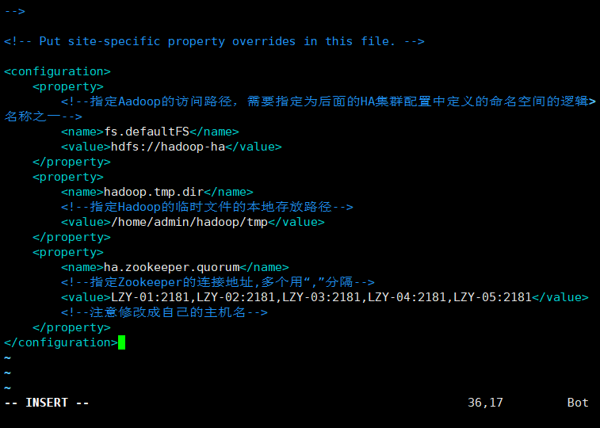

对配置文件进行修改

```shell
vi hdfs-site.xml
```

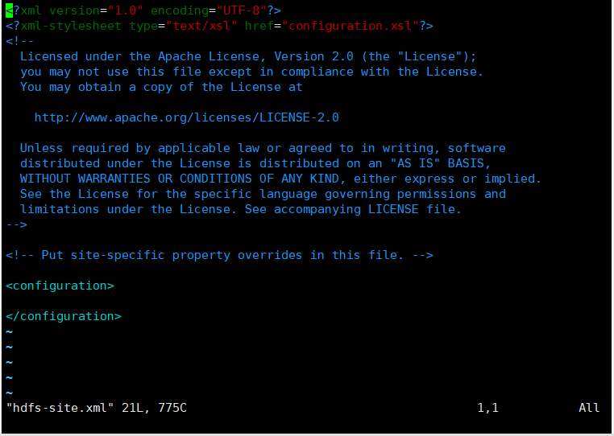

找到标签`<configuration>`所在的位置，在其中添加如下内容:

```xml
<configuration>
    <property>
        <name>dfs.nameservices</name>
        <value>hadoop-ha</value>
    </property>
    <property>
        <name>dfs.ha.namenodes.hadoop-ha</name>
        <value>name-1,name-2</value>
    </property>
    <property>
        <name>dfs.namenode.rpc-address.hadoop-ha.name-1</name>
        <value>LZY-01:9000</value>
        <!-- 注意改名 -->
    </property>
    <property>
        <name>dfs.namenode.http-address.hadoop-ha.name-1</name>
        <value>LZY-01:50070</value>
        <!-- 注意改名 -->
    </property>
    <property>
        <name>dfs.namenode.rpc-address.hadoop-ha.name-2</name>
        <value>LZY-02:9000</value>
        <!-- 注意改名 -->
    </property>
    <property>
        <name>dfs.namenode.http-address.hadoop-ha.name-2</name>
        <value>LZY-02:50070</value>
        <!-- 注意改名 -->
    </property>
    <property>
        <name>dfs.namenode.shared.edits.dir</name>
        <value>qjournal://LZY-03:8485;LZY-04:8485;LZY-05:8485/hadoop-ha</value>
        <!-- 注意改名 -->
    </property>
    <property>
        <name>dfs.journalnode.edits.dir</name>
        <value>/home/admin/hadoop/journal</value>
    </property>
    <property>
        <name>dfs.ha.automatic-failover.enabled</name>
        <value>true</value>
    </property>
    <property>
       <name>dfs.client.failover.proxy.provider.hadoop-ha</name>
        <value>org.apache.hadoop.hdfs.server.namenode.ha.ConfiguredFailoverProxyProvider</value>
    </property>

    <property>
        <name>dfs.ha.fencing.methods</name>
        <value>
            sshfence
            shell(/bin/true)
        </value>
    </property>
    <property>
        <name>dfs.ha.fencing.ssh.private-key-files</name>
        <value>/home/admin/.ssh/id_rsa</value>
    </property>
    <property>
        <name>dfs.ha.fencing.ssh.connect-timeout</name>
        <value>30000</value>
    </property>
    <property>
        <name>dfs.namenode.name.dir</name>
        <value>/home/admin/hadoop/name</value>
    </property>
    <property>
        <name>dfs.datanode.data.dir</name>
        <value>/home/admin/hadoop/data</value>
    </property>
    <property>
        <name>dfs.replication</name>
        <value>3</value>
    </property>
</configuration>
```

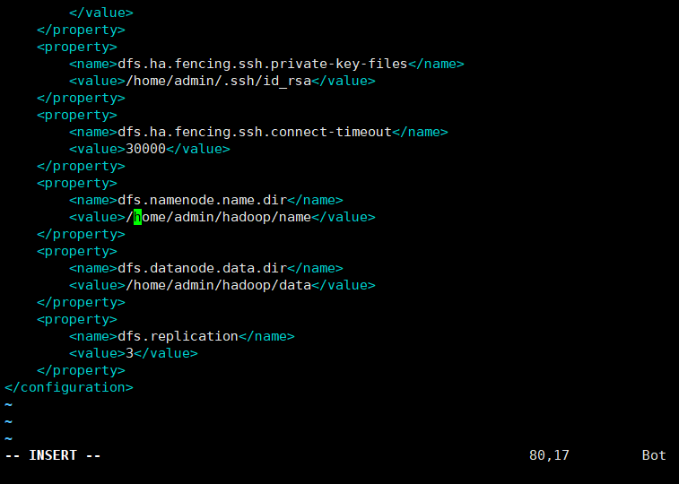

由模板文件拷贝生成配置文件`mapred-site.xml`

```shell
cp mapred-site.xml.template mapred-site.xml
```

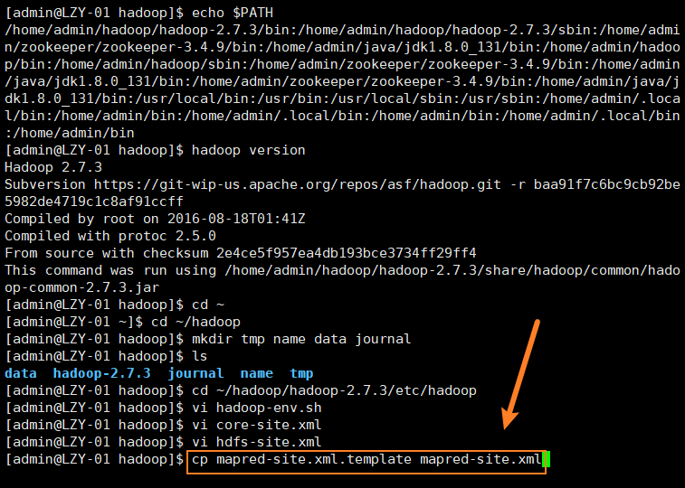

对配置文件进行修改

```shell
vi mapred-site.xml
```

找到标签`<configuration>`所在的位置，在其中添加如下内容:

```xml
<configuration>
    <property>
        <name>mapreduce.framework.name</name>
        <value>yarn</value>
    </property>
</configuration>
<!--指定MapReduce所使用的外部管理框架，这里使用Hadoop 2.7.3自带的YARN资源管理器-->
```

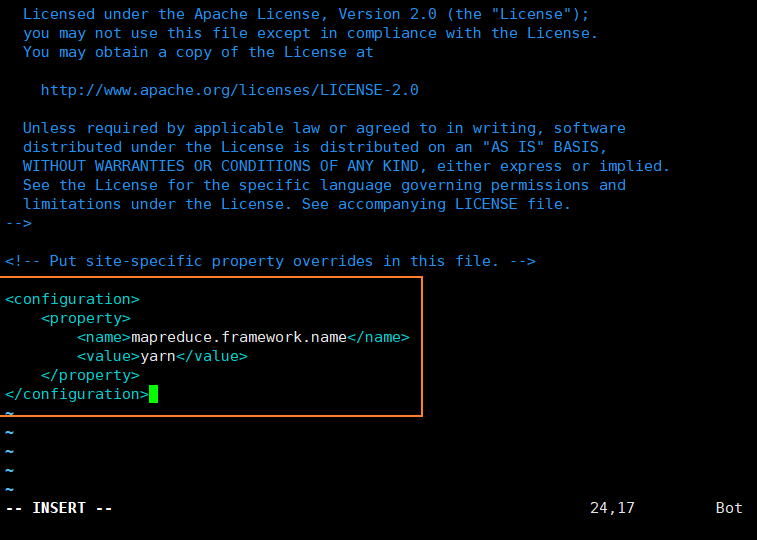

对配置文件进行修改

```shell
vi yarn-env.sh
```

找到配置项`JAVA_HOME`所在行，将其改为以下内容:(注意取消注释`#`，顶格)

```shell
export JAVA_HOME=/home/admin/java/jdk1.8.0_131
#该路径以JDK软件包实际解压解包的路径为准
```

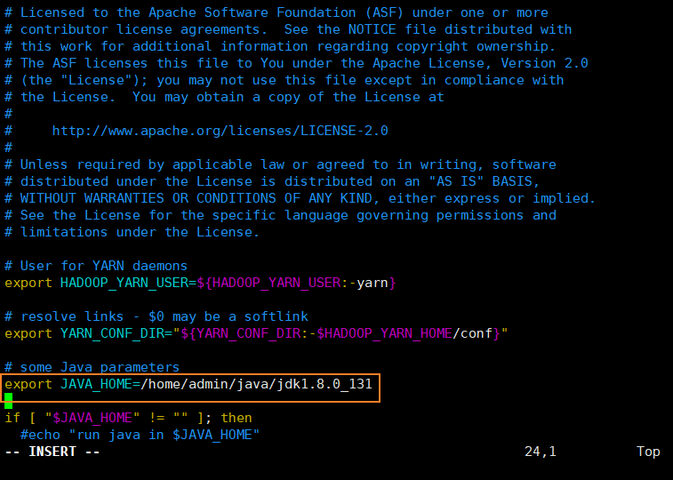

对配置文件进行修改

```shell
vi yarn-site.xml
```

找到标签`<configuration>`所在的位置，在其中添加如下内容:

```xml
<configuration>
    <!--Site
specific YARN congfigurationproerties-->
    <property>
        <name>yarn.resourcemanager.ha.enabled</name>
        <value>true</value>
    </property>
    <property>
        <name>yarn.resourcemanager.cluster-id</name>
        <value>yarn-ha</value>
    </property>
    <property>
        <name>yarn.resourcemanager.ha.rm-ids</name>
        <value>resource-1,resource-2</value>
    </property>
    <property>
        <name>yarn.resourcemanager.hostname.resource-1</name>
        <value>LZY-01</value>
        <!-- 注意改名 -->
    </property>
    <property>
        <name>yarn.resourcemanager.hostname.resource-2</name>
        <value>LZY-02</value>
        <!-- 注意改名 -->
    </property>
    <property>
        <name>yarn.resourcemanager.zk-address</name>
        <value>LZY-01:2181,LZY-02:2181,LZY-03:2181,LZY-04:2181,LZY-05:2181</value>
        <!-- 注意改名 -->
    </property>
    <property>
        <name>yarn.nodemanager.aux-services</name>
        <value>mapreduce_shuffle</value>
    </property>
</configuration>

```

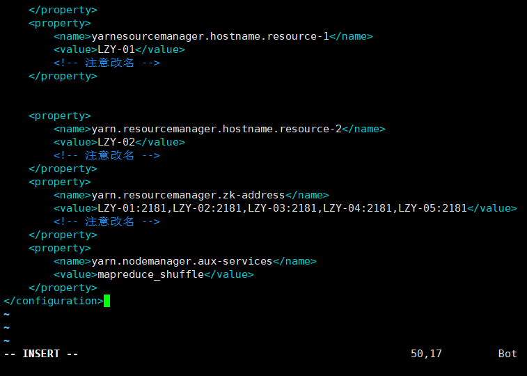


对配置文件进行修改

```shell
vi slaves
```

删除文件中原有的所有内容，然后添加集群中所有数据节点的主机名，每行一个主机的主机名，

配置格式如下:

```shell
LZY-03
LZY-04
LZY-05
```


备注:

如果你要把主节点和主节点备用节点同时作为数据节点使用，也是可以的，这里加上01和02即可。后面配置要一致。


## 同步安装和配置

将`hadoop`目录和`.bash_profile`文件发给集群中所有主机，发送目标用户为集群专用用户`admin`，

发送目标路径为`/home/admin`

即集群专用用户`admin`的家目录。

```shell
scp -r ~/hadoop ~/.bash_profile admin@LZY-02:/home/admin

scp -r ~/hadoop ~/.bash_profile admin@LZY-03:/home/admin

scp -r ~/hadoop ~/.bash_profile admin@LZY-04:/home/admin

scp -r ~/hadoop ~/.bash_profile admin@LZY-05:/home/admin
```

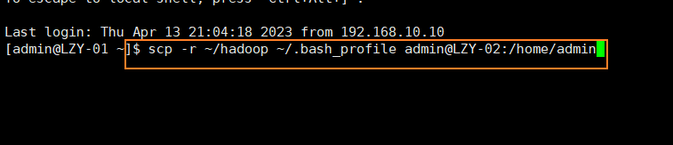

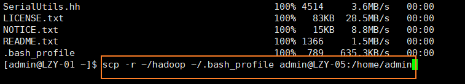

集群中每台主机分别进行以下命令操作:

```shell
source ~/.bash_profile
#使新配置的环境变量立即生效
echo $HADOOP_HOME
#查看新添加和修改的环境变量是否
echo $PATH
#设置成功，以及环境变量的值是否正确。
hadoop version
#验证Hadoop的安装配置是否成功
```

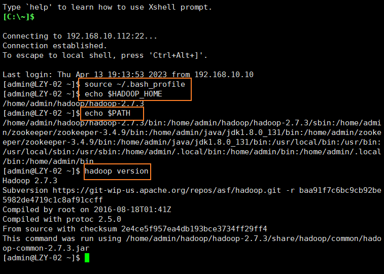


## Hadoop高可用完全分布模式格式化和启动

★注意本节格式化内容不可多次执行(★注意格式化步骤)

```shell
hadoop-daemon.sh start journalnode
```

在**所有同步通信节点**的主机执行，启动同步通信服务，然后使用命令`jps`查看`Java`进程信息，若有名为`JournalNode`的进程，则表示同步通信节点启动成功。
注:本操作只在第一次安装时执行。安装完成后，以及关机重启服务器后不需要再次执行。

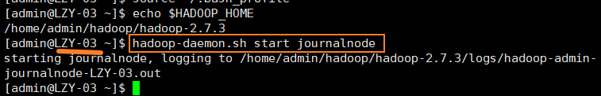

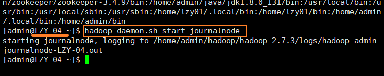

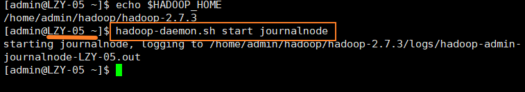


在**主节点**使用此命令，对HDFS进行格式化，若格式化过程中没有报错则表示格式化成功。

注:本操作只在**第一次安装**时执行。安装完成后，以及关机重启服务器后不需要再次执行。

**千万不要多次格式化**

```shell
hadoop namenode -format
```

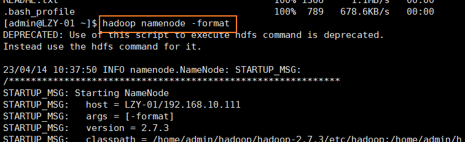


格式化完成后将`hadoop`目录下的`name`目录发给集群中所有**备用主节点**的主机，

发送目标用户为集群专用用户`admin`，即当前与登录用户同名的用户

发送目标路径为`/home/admin/hadoop`,即集群专用用户`admin`家目录下的`Hadoop`相关文件的目录。

```shell
scp -r ~/hadoop/name admin@LZY-02:/home/admin/hadoop
```

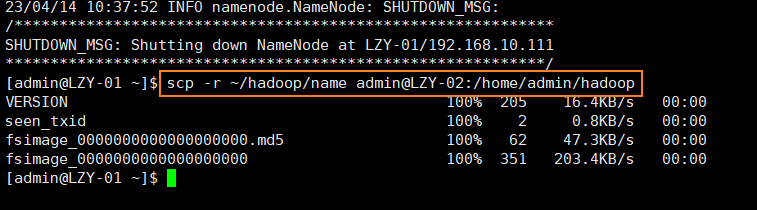


在集群中**所有主机**上使用此命令，查看该节点**Zookeeper**服务当前的状态

若集群中只有一个`leader`节点，其余的均为`follower`节点，则集群的工作状态正常。

```shell
zkServer.sh status
```

如果**Zookeeper**未启动，则在集群中所有主机上使用命令`zkServer.sh start`启动Zookeeper服务的脚本。

```shell
zkServer.sh start
```

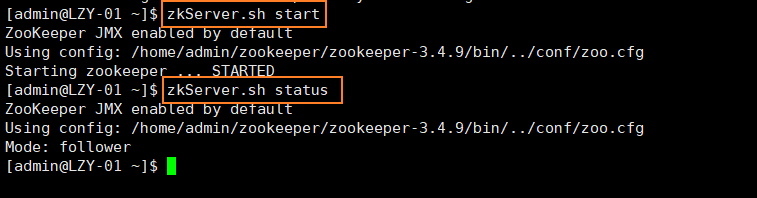


在**主节点**使用命令,对**Hadoop**集群在**Zookeeper**中的主节点切换控制信息进行格式化，

若格式化过程中没有报错则表示格式化成功。

格式化之前确保集群中各主机Zookeeper开启。

注:本操作只在**第一次安装时执行**。安装完成后，以及关机重启服务器后不需要再次执行。不要重复格式化。

```shell
hdfs zkfc -formatZK
```

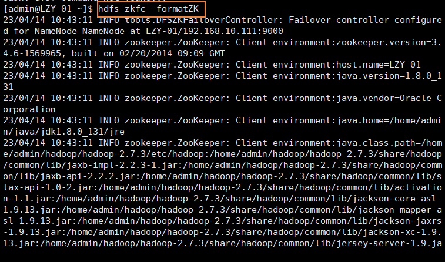


在**所有同步通信节点**的主机，使用此命令，关闭同步通信服务。

注:本操作只在第一次安装时执行。安装完成后，以及关机重启服务器后不需要再次执行。

```shell
hadoop-daemon.sh stop journalnode
```

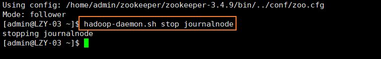

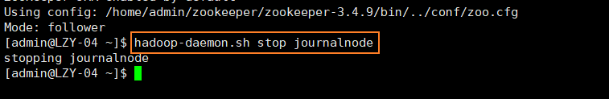

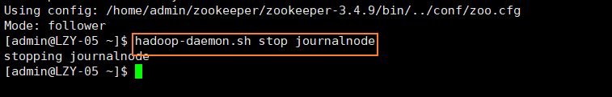


在**主节点**使用命令,启动Hadoop集群。

```shell
start-all.sh
```

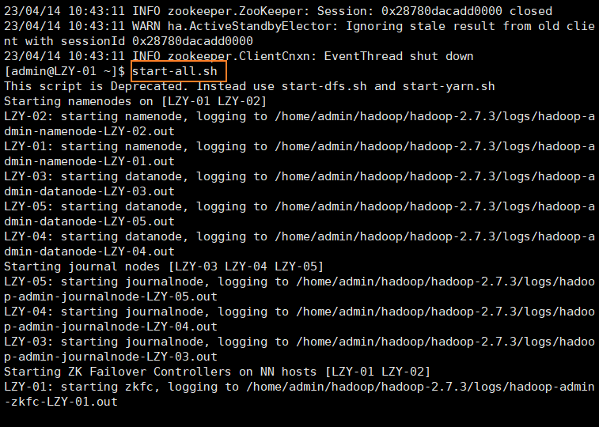


在所有**备用主节点**的主机，使用此命令，启动**YARN**主节点服务。

```shell
yarn-daemon.sh start resourcemanager
```

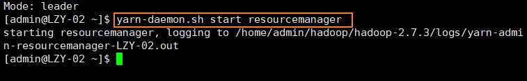

启动命令，每次重启后，在zookeeper动成功的前提下，只需执行此两步即可。


在**主节点**使用命令`jps`查看Java进程信息，若有名为`NameNode`、`ResourceManager`、`DFSZKFailoverController`的三个进程，则表示Hadoop集群的**主节点**启动成功。

```shell
jps
```

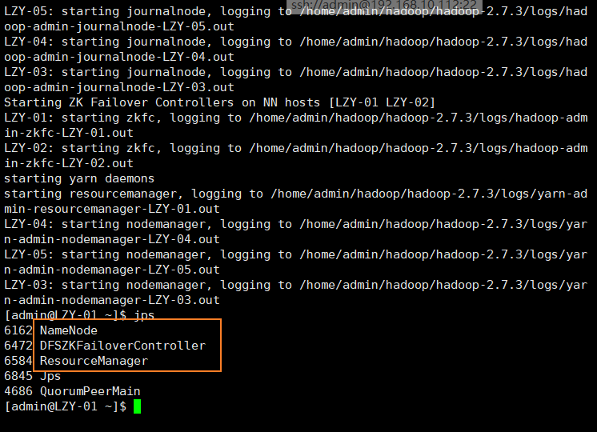


**ResourceManager**未启动时

```shell
cd /home/admin/hadoop/hadoop-2.7.3/logs
```

查看对应的log文件


可以使用命令`hadoop dfsadmin -report`查看**HDFS**状态。

```shell
hadoop dfsadmin -report
```

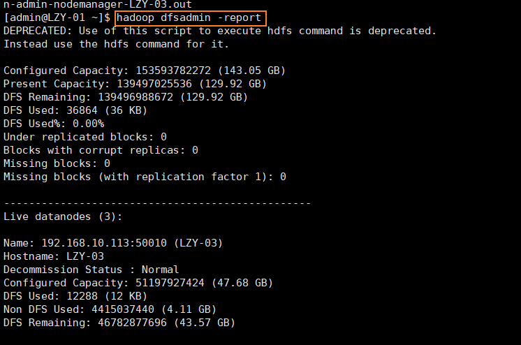

使用命令`ssh 目标主机名或P地址`远程登录到**所有备用主节点**主机，使用命令`jps`查看Java进程信息

若有名为`NameNode`、`ResourceManager`、`DFSZKFailoverController`的三个进程，则表示Hadoop集群的**备用主节点**启动成功。

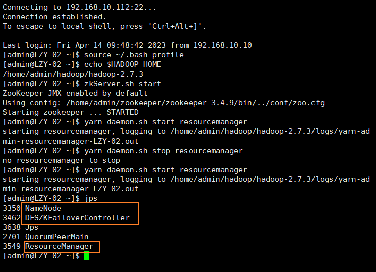


使用命令`ssh 目标主机名或P地址`远程登录到**所有数据节点**主机，使用命令`jps`查看Java进程信息，

若有名为`DataNode` 、`NodeManager`、`JournalNode`的三个进程，则表示**Hadoop**集群的**数据节点**启动成功。


## Hadoop高可用完全分布模式验证

在**Hadoop**中创建当前登录用户自己的目录

```shell
hadoop fs -mkdir -p /user/admin
```

查看HDFS中的所有文件和目录的结构

```shell
hadoop fs -ls -R /
```

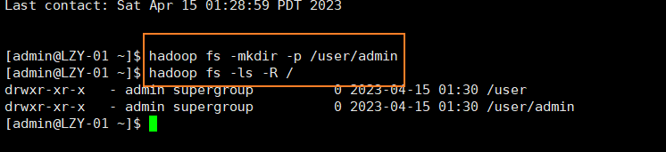


```shell
cd ~/hadoop/hadoop-2.7.3/share/hadoop/mapreduce
#进入Hadoop的示例程序包hadoop-mapreduce-examples-2.7.3.jar所在目录
hadoop jar hadoop-mapreduce-examples-2.7.3.jar pi 2 1000
#运行使用蒙地卡罗法计算PI的示例程序
```

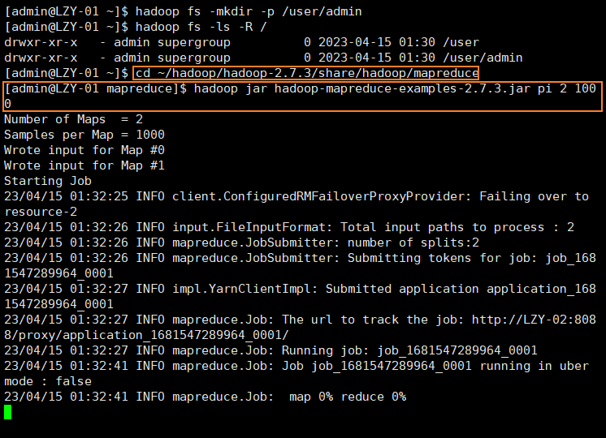

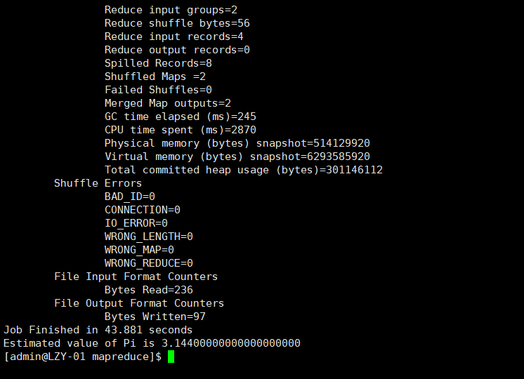
