## HBase shell的基本用法

### 准备工作

```shell
 zkServer.sh start 
 #如果Zookeeper未启动，则在集群中所有主机上使用命令“zkServer.shstart”启动Zookeeper服务的脚本
 jps
```


```shell
start-all.sh
#主节点
yarn-daemon.sh start resourcemanager
#备用主节点
jps
```


``` shell
start-hbase.sh
#在主节点使用此命令,启动HBase集群
jps
```

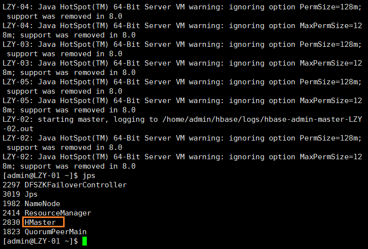

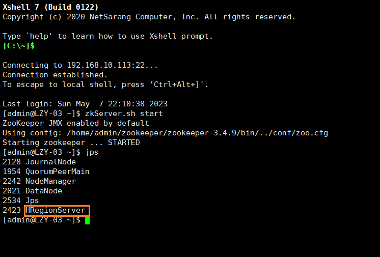


**注意：**

如果主节点**HMaster**未启动，使用如下命令关闭2号机**NameNode**,

```shell
hadoop-daemon.sh stop namenode
```

重启**Hbase**

```shell
start-hbase.sh
```


### 基本命令(DDL/DML)

```shell
hbase shell
#进入Habase命令界面
```

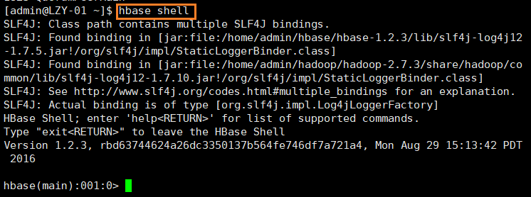

#### 新建表空间

```shell
create_namespace 'testDB'
list_namespace
drop_namespace 'testDB'
#表空间为空才能删除
```

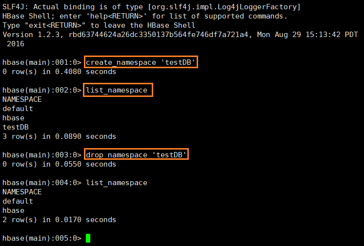


**备注:**

对于建表，和RDBMS类似，HBase也有namespace的概念，可以指定表空间创建表，也可以直接创建表，进入default表空间
HBase系统默认定义了两个缺省的namespace:

- hbase:系统内建表，包括namespace和meta表
- default:用户建表时未指定namespace的表都创建在此

```shell
create_namespace 'testDB'
quit
hadoop fs -ls hbase/data
hadoop fs -ls hbase/data/hbase
hadoop fs -ls hbase/data/hbase/meta
```

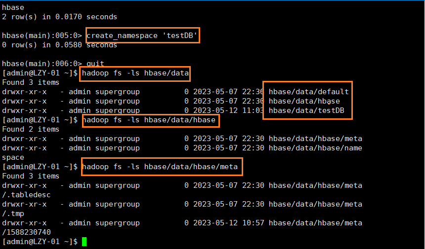

#### 建立一个表和列族（默认表空间）

```shell
hbase shell
```

代码如下：

```shell
create 'scores', 'grade', 'course'
list
```

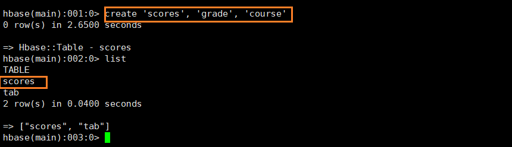

```shell
describe 'scores'
```

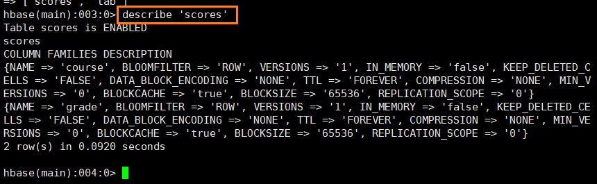

```shell
create 'testDB:scores' , 'grade', 'course'
```

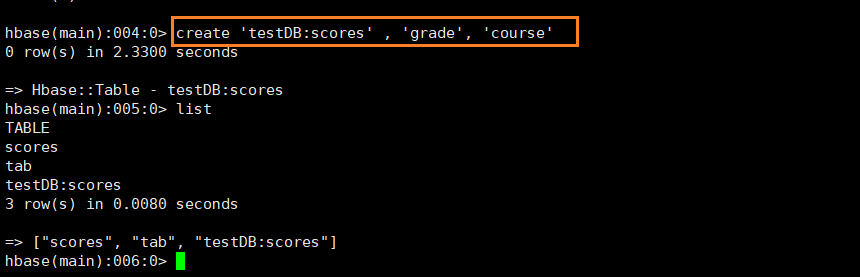


#### 按设计的表结构插入值

```shell
put 'scores','Tom','grade:','5'
put 'scores','Tom','course:math','97'
put 'scores','Tom','course:art','87'
put 'scores','Jim','grade','4'
put 'scores','Jim','course:math','89'
put 'scores','Jim','course:art','80'
put 'scores','Jim','course:','90'
put 'scores','Jim','course:','91'
```

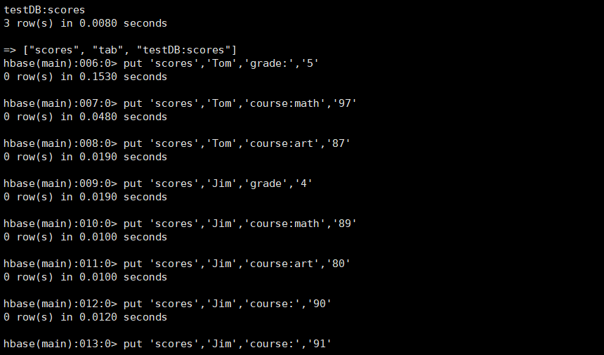


代码解析:

```shell
put 't1', 'r1', 'c1', 'value', ts1
```

`t1`指表名，`r1`指行键名，`c1`指列名，`value`指单元格值。`ts1`指时间戳，一般都省略掉了。


#### 根据键值查询数据

```shell
get 'scores','Jim'
get 'scores','Jim','grade'
```

HBase的shell操作，一个大概顺序就是操作关键词后跟**表名，行名，列名**这样的一个顺序，如果有其他条件再用花括号加上

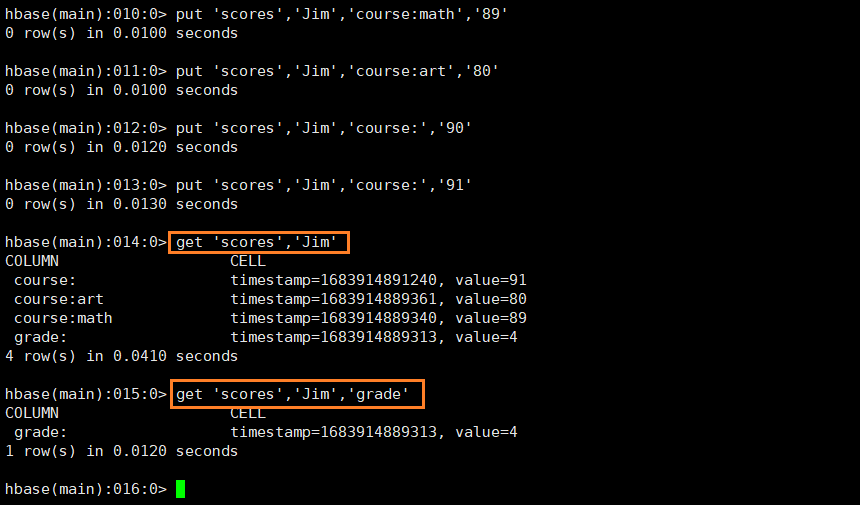

练习:

```shell
get 'scores','Tom'
get 'scores', 'Tom'
get 'Jim'
```

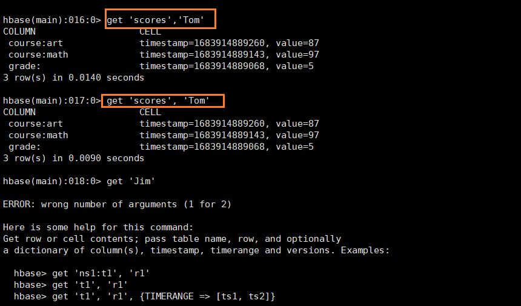

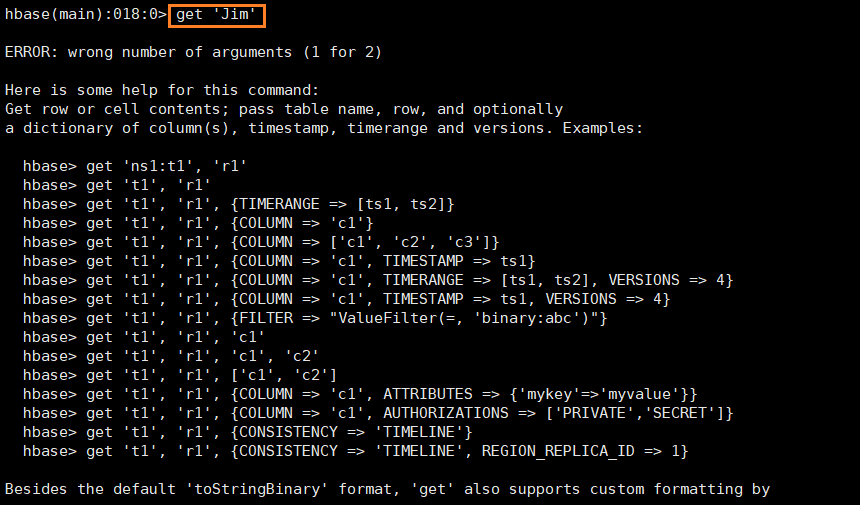

#### 扫描所有数据

```shell
scan 'scores'
```

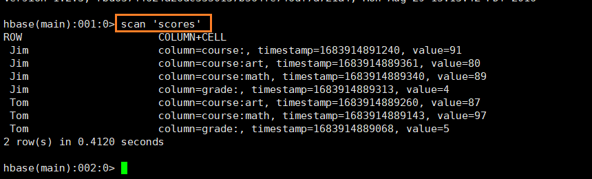

**扫描指定列**

```shell
scan 'scores',{COLUMNS => ['grade']}
```

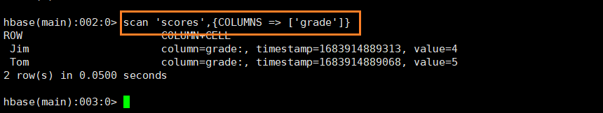

练习：

```shell
scan 'scores',['grade']
```


#### 统计行数

```shell
count 'scores'
```

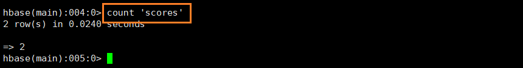


#### 删除指定数据

```shell
get 'scores','Jim'
delete 'scores','Jim','course:art'
get 'scores','Jim'
```

如果需要进行全表删除操作，就使用`truncate`命令，其实没有直接的全表删除命令，这个命令也是`disable`，`drop`，`create`三个命令组合出来的。

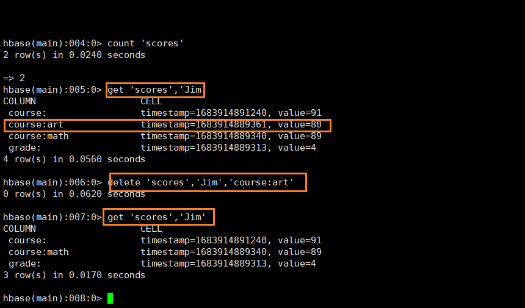

练习:

```shell
delete 'scores','Jim','course:'
get 'scores','Jim'
```

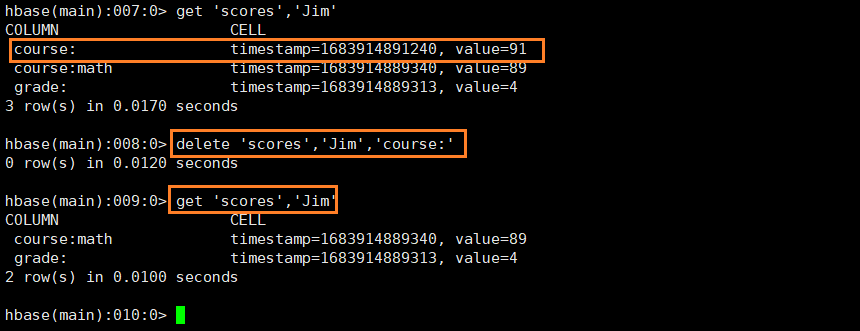


#### 删除整行

```shell
get 'scores','Jim'
deleteall 'scores','Jim'
get 'scores','Jim'
```

`deleteall`命令，可以进行整行的范围的删除操作，谨慎使用。

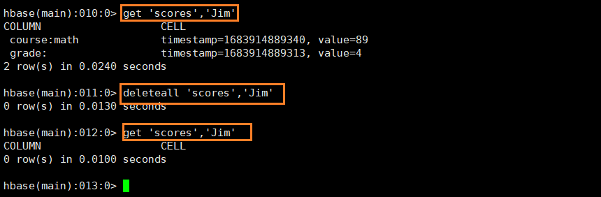

练习:

```shell
deleteall 'scores', 'Tom'
scan 'scores'
```

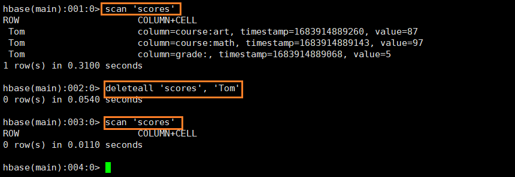

#### 将整张表清空

```shell
truncate 'scores'
list
```

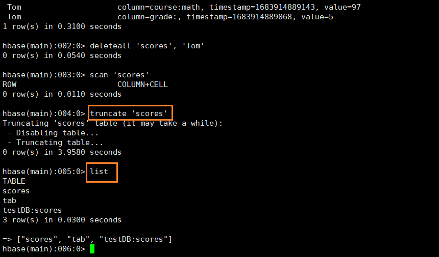


#### 表的删除


1. **先进行disable 和enable 操作**

   ```shell
   disable'scores'
   enable 'scores'
   ```

   很多操作需要先暂停表的可用性，比如删除表操作。`disable_all`和`enable_all`能够操作更多的表。

2. **表的删除**

   ```shell
   disable 'scores'
   drop 'scores'
   scan 'scores'
   list
   ```

   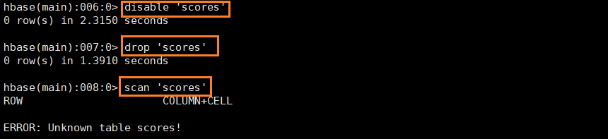

   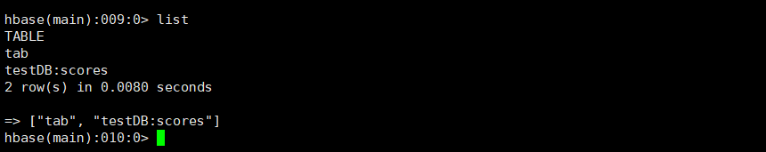


练习：

```shell
disable 'testDB:scores'
drop 'testDB:scores'
scan 'testDB:scores'
```

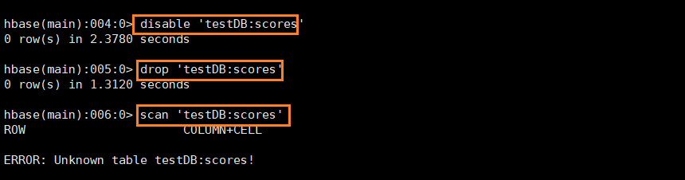


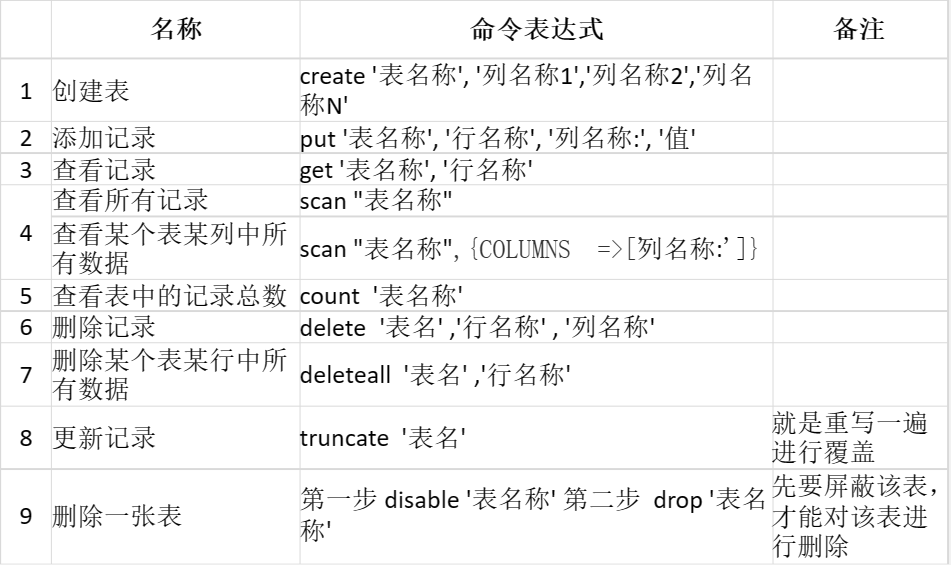


## 作业 

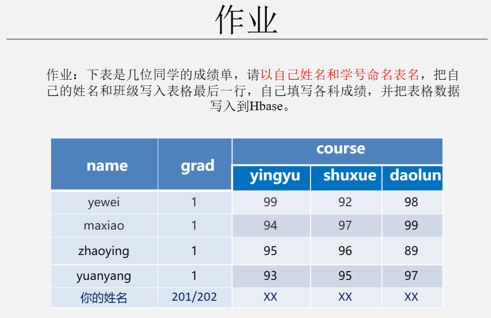


```shell
create 'lzy_20200802050211','grad','course'

put 'lzy_20200802050211','yewei','grad:','1'
put 'lzy_20200802050211','maxiao','grad:','1'
put 'lzy_20200802050211','zhaoying','grad:','1'
put 'lzy_20200802050211','yuanyang','grad:','1'

put 'lzy_20200802050211','yewei','course:yingyu','99'
put 'lzy_20200802050211','maxiao','course:yingyu','94'
put 'lzy_20200802050211','zhaoying','course:yingyu','95'
put 'lzy_20200802050211','yuanyang','course:yingyu','93'

put 'lzy_20200802050211','yewei','course:shuxu','92'
put 'lzy_20200802050211','maxiao','course:shuxu','97'
put 'lzy_20200802050211','zhaoying','course:shuxu','96'
put 'lzy_20200802050211','yuanyang','course:shuxu','95'

put 'lzy_20200802050211','yewei','course:daolun','98'
put 'lzy_20200802050211','maxiao','course:daolun','99'
put 'lzy_20200802050211','zhaoying','course:daolun','89'
put 'lzy_20200802050211','yuanyang','course:daolun','97'

put 'lzy_20200802050211','lzy','grad:','202'
put 'lzy_20200802050211','lzy','course:yingyu','100'
put 'lzy_20200802050211','lzy','course:shuxu','100'
put 'lzy_20200802050211','lzy','course:daolun','100'

scan 'lzy_20200802050211'
```

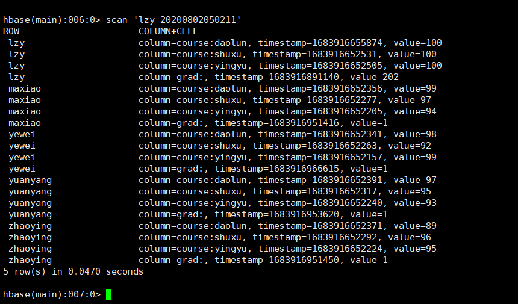

```shell
disable 'lzy_20200802050211'
drop 'lzy_20200802050211'
scan 'lzy_20200802050211'
```


```shell
create 'lzy_11','name','grad','course'

put 'lzy_11','1','name:','yewei'
put 'lzy_11','2','name:','maxiao'
put 'lzy_11','3','name:','zhaoying'
put 'lzy_11','4','name:','yuanyang'

put 'lzy_11','1','grad:','1'
put 'lzy_11','2','grad:','1'
put 'lzy_11','3','grad:','1'
put 'lzy_11','4','grad:','1'

put 'lzy_11','1','course:yingyu','99'
put 'lzy_11','2','course:yingyu','94'
put 'lzy_11','3','course:yingyu','95'
put 'lzy_11','4','course:yingyu','93'

put 'lzy_11','1','course:shuxu','92'
put 'lzy_11','2','course:shuxu','97'
put 'lzy_11','3','course:shuxu','96'
put 'lzy_11','4','course:shuxu','95'

put 'lzy_11','1','course:daolun','98'
put 'lzy_11','2','course:daolun','99'
put 'lzy_11','3','course:daolun','89'
put 'lzy_11','4','course:daolun','97'

put 'lzy_11','5','name:','lzy'
put 'lzy_11','5','grad:','202'
put 'lzy_11','5','course:yingyu','100'
put 'lzy_11','5','course:shuxu','100'
put 'lzy_11','5','course:daolun','100'

scan 'lzy_11'
```

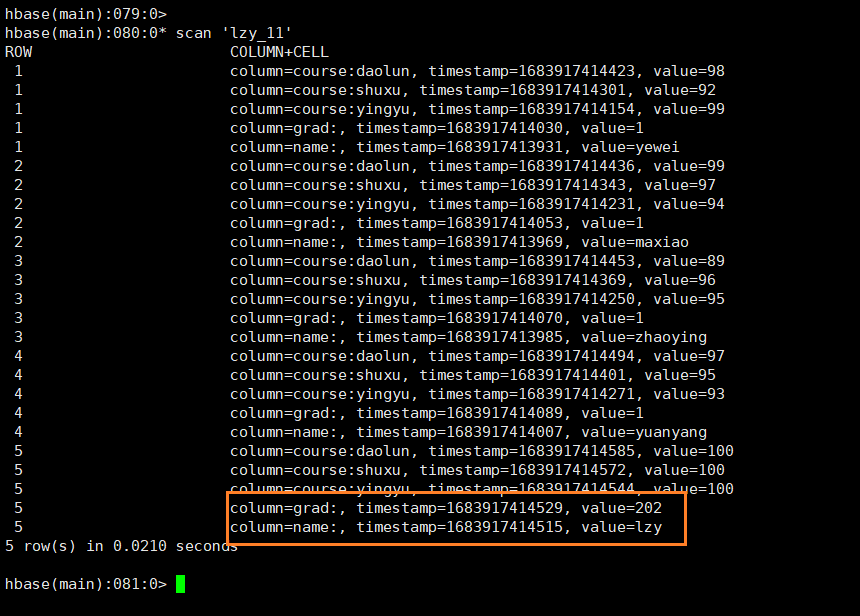


## HBase作用

HBase基于Google的BigTable论文，是建立的**HDFS**之上，提供**高可靠性**、**高性能**、**列存储**、**可伸缩**、**实时读写**的分布式数据库系统。
在需要**实时读写随机访问**超大规模数据集时，可以使用HBase。

#### 优点

1. 海量存储
   Hbase适合存储PB级别的海量数据，在PB级别的数据以及采用廉价PC存储的情况下，能在几十到百毫秒内返回数据。这与Hbase的极易扩展性息息相关。正式因为Hbase良好的扩展性，才为海量数据的存储提供了便利。
2. 列式存储
   这里的列式存储其实说的是列族（ColumnFamily）存储，Hbase是根据列族来存储数据的。列族下面可以有非常多的列，列族在创建表的时候就必须指定。
3. 极易扩展
   Hbase的扩展性主要体现在两个方面，一个是基于上层处理能力（RegionServer）的扩展，一个是基于存储的扩展（HDFS）。
   通过横向添加RegionSever的机器，进行水平扩展，提升Hbase上层的处理能力，提升Hbsae服务更多Region的能力。
   备注：RegionServer的作用是管理region、承接业务的访问，这个后面会详细的介绍通过横向添加Datanode的机器，进行存储层扩容，提升Hbase的数据存储能力和提升后端存储的读写能力。
4. 高并发（多核）
   由于目前大部分使用Hbase的架构，都是采用的廉价PC，因此单个IO的延迟其实并不小，一般在几十到上百ms之间。这里说的高并发，主要是在并发的情况下，Hbase的单个IO延迟下降并不多。能获得高并发、低延迟的服务。
5. 稀疏
   稀疏主要是针对Hbase列的灵活性，在列族中，你可以指定任意多的列，在列数据为空的情况下，是不会占用存储空间的。
