## Hive工具安装配置

### Hive工具安装配置

- Hive安装过程的所有操作步骤都需要使**admin**用户进行。
- 本项步骤只在集群中**Cluster-01**主机上进行操作即可。

```shell
su admin
mkdir setups
```

我们以前创建过，如果提示已存在，则直接上传软件包即可

首先，我们把相关软件包`apache-hive-2.1.1-bin.tar.gz`和`mysql-connector-java-5.1.42-bin.jar`上传到`admin`用户家目录的新建`setups`目录下。

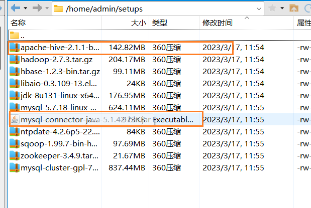


命令:

```shell
mkdir ~/hive
#创建用于存放Hive相关文件的目录
cd ~/hive
#进入该目录
mkdir tmp
#创建Hive的本地临时文件目录“tmp'
tar -xzf ~/setups/apache-hive-2.1.1-bin.tar.gz
#软件包解压解包到'hive'目录下
```

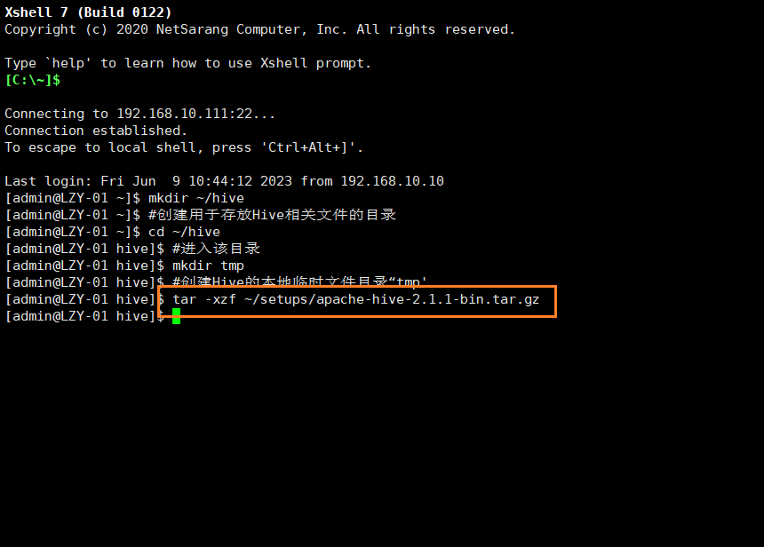


```shell
vi ~/.bash_profile
```

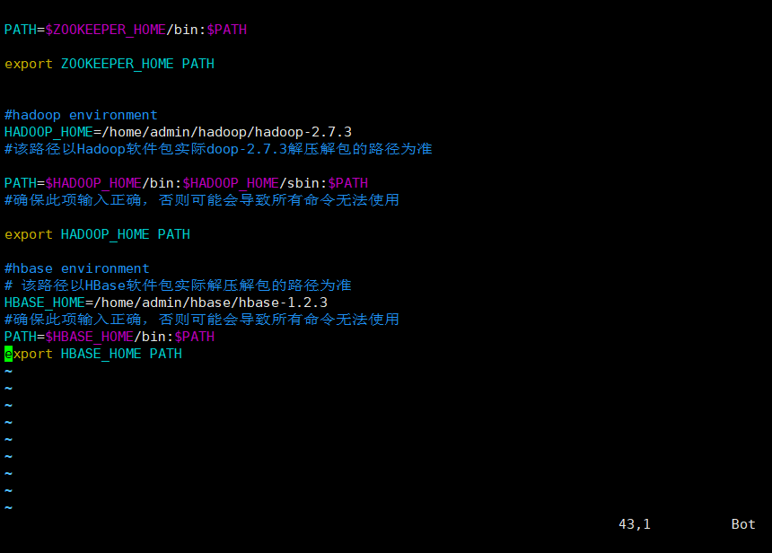

配置Hive相关的环境变量对配置文件进行修改，在文件末尾添加以下内容:

```shell
#hive environment
HIVE_HOME=/home/admin/hive/apache-hive-2.1.1-bin
#该路径以Hive软件包实际解压解包的路径为准

#确保此项输入正确，否则可能会导致所有命令无法使用
PATH=$HIVE_HOME/bin:$PATH
export HIVE_HOME PATH
#必须按照前面的定义顺序书写
```

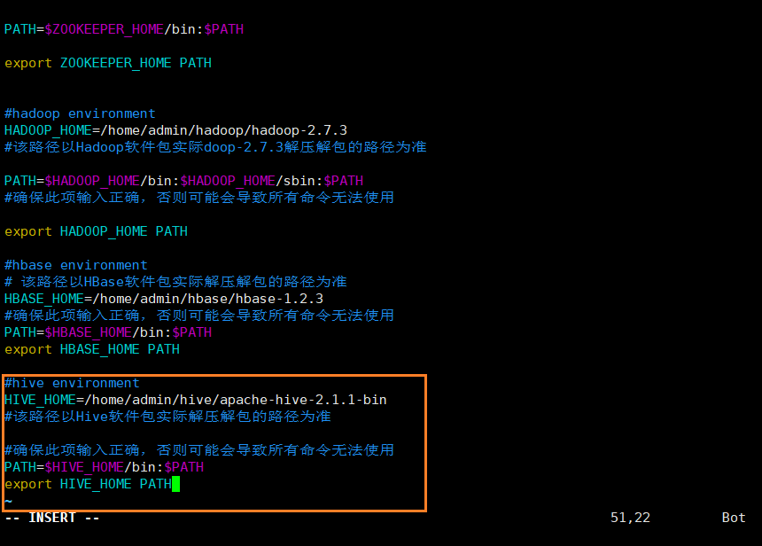

```shell
source ~/.bash_profile
echo $HIVE_HOME
echo $PATH
#查看新添加和修改的环境变量是否设置成功，以及环境变量的值是否正确。
```

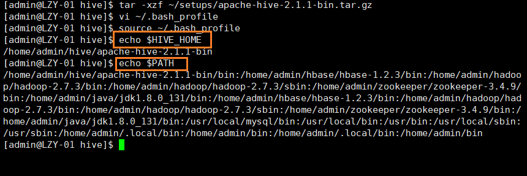


```shell
cd ~/hive/apache-hive-2.1.1-bin/conf
#进入Hive的配置文件目录
#Hive的配置文件默认都被命名为了模板文件，需要对其进行拷贝重命名之后才能使用:
cp hive-env.sh.template hive-env.sh
cp hive-log4j2.properties.template hive-log4j2.properties
cp hive-exec-log4j2.properties.template hive-exec-log4j2.properties
cp hive-default.xml.template hive-site.xml
```

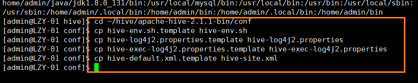


```shell
vi hive-env.sh
#对配置文件进行修改，找到相关配置项并对其值进行修改
```

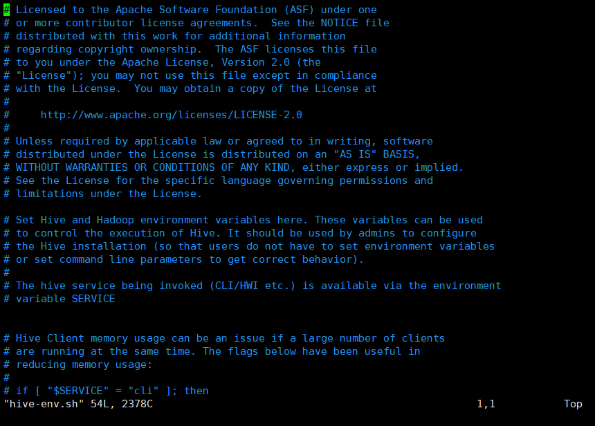

找到配置项`HADOOP_HOME`该项用于指定`Hadoop`所在的路径，将其值改为以下内容:

```shell
HADOOP_HOME=/home/admin/hadoop/hadoop-2.7.3
#该路径以Hadoop软件包实际解压解包的路径为准
```

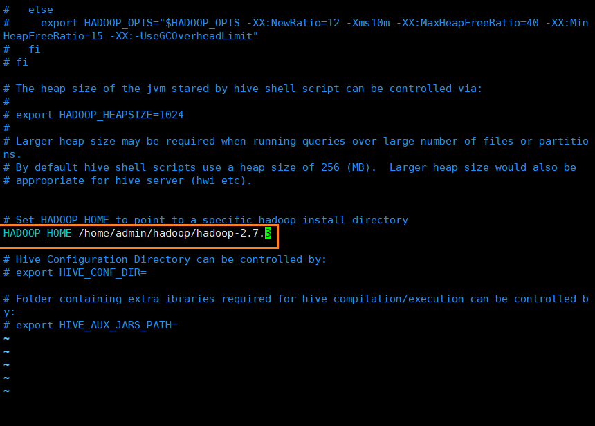

找到配置项`HIVE_CONF_DIR `该项用于指定Hive的配置文件所在的路径，将其值改为以下内容:

```shell
export HIVE_CONF_DIR=/home/admin/hive/apache-hive-2.1.1-bin/conf
#该路径以实际Hive配置文件模板拷贝的路径为准
```

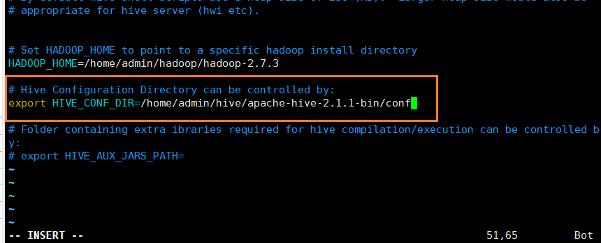

找到配置项`HIVE_AUX JARS_PATH`该项用于指定`Hive`的`lib`文件所在的路径，将其值改为以下内容:

```shell
export HIVE_AUX_JARS_PATH=/home/admin/hive/apache-hive-2.1.1-bin/lib
#路径以实际的Hive的lib文件所在路径为准
```

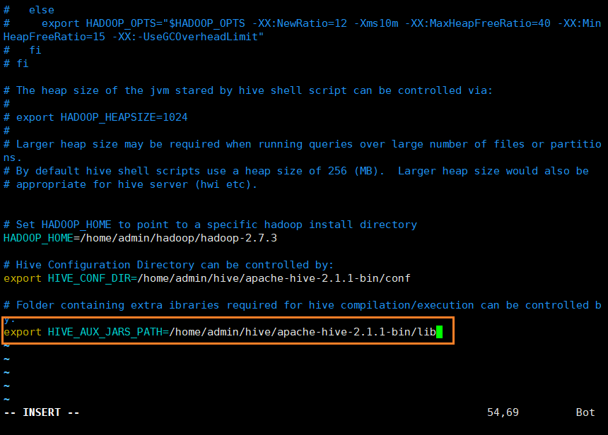


- 该项的所有操作步骤使用专门用于集群的用户**admin**进行。
- 启动HBas集群之前首先确保Zookeeper集群已被开启状态。（实验5台）Zookeeper的启动需要分别在每个计算机的节点上手动启动。如果家目录下执行启动报错，则需要进入zookeeper/bin目录执行启动命令。
- 启动HBase集群之前首先确保Hadoop集群已被开启状态。(实验5台)
- Hadoop只需要在主节点执行启动命令。

```shell
#在集群中所有主机上使用命令“zkServer.sh
zkServer.sh status
#status查看该节点Zookeeper服务当前的状态，若集群中只有一个“leade节点，其余的均为“followe节点，则集群的工作状态正常。
zkServer.sh start
#如果Zookeeper未启动，则在集群中所有主机上使用命令“zkServer.sh start启动Zookeeper服务的脚本
jps
#在主节点,查看Java进程信息，若有名为“NameNode、“ResourceManager的两个进程，则表示Hadoop集群的主节点启动成功。在每台数据节点，若有名为“DataNode和“NodeManagér的两个进程，则表示Hadoop集群的数据节点启动成功
start-all.sh
#如果不存在以上三个进程，则在主节点使用命令,启动Hadoop集群。
yarn-daemon.sh start resourcemanager

start-hbase.sh
#确定Hadoop集群己启动状态，然后在主节点使用此命令,启动HBase集群。
jps
#在集群中所有主机上使用命令“jps”
```


```shell
hadoop fs -mkdir -p /user/hive/tmp
hadoop fs -mkdir -p /user/hive/warehouse
hadoop fs -mkdir -p /user/hive/log
#在HDFS中分别创建Hive的临时文件目录“tmp”
#在HDFS中分别创建Hive的数据存储目录“warehouse
#在HDFS中分别创建Hive的日志文件目录“log”
hadoop fs -chmod 777 /user/hive/tmp
hadoop fs -chmod 777 /user/hive/warehouse
hadoop fs -chmod 777 /user/hive/log
#添加三个目录的用户组写权限
```


```shell
vi ~/hive/apache-hive-2.1.1-bin/conf/hive-site.xml
```

对配置文件进行修改

找到下列标签`<name>`所标识的属性项名称所在位置，修改其标签`<value>`所标识的属性值部分的内容：

```xml
<configuration>
    <!--指定Hive的数据临时文件存储目录，需要是位于HDFS上的目录-->
    <property>
        <name>hive.exec.scratchdir</name>
        <value>/user/hive/tmp</value>
    </property>
    <!--指定Hive的数据存储目录，需要是位于HDFS上的目录--><property>
    <name>hive.metastore.warehouse.dir</name>
    <value>/user/hive/warehouse</value>
    </property>
    <!--指定Hive的日志文件目录，需要是位于HDFS上的目录-->
    <property>
        <name>hive.querylog.location</name>
        <value>/user/hive/log</value>
        <description>Location of Hive run time structured log file</description>
    </property>
</configuration>
```

该文档内容较多，可以在编辑器内使用命令`/关键字`直接进行搜索，使用快捷键`n`可以切换到下一个关键字的所在位置。


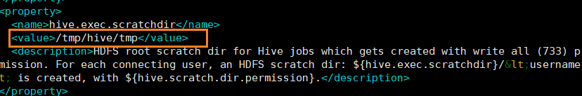


### 创建hive元数据数据库

- 只有本操作步骤（两页）需要使用**root**用户进行。
- 只有本项步骤只在集群中**Cluster-04**主机上进行操作即可

启动mysql集群

### 启动顺序

1. 先启动管理节点
2. 再启动两个数据服务节点
3. 最后启动SQL节点

```shell
ndb_mgmd -f /usr/local/mysql/etc/config.ini
ndbd
service mysql start
```


```shell
mysql -h LZY-04 -u root -p
```

- 在集群中**Cluster-04**主机上进行操作

```sql
#在控制台执行以下命令进行数据库的创建：
CREATE DATABASE hive;#（创建数据库hive）
USE hive;#（切换到新创建的hive数据库）
CREATE USER 'hive'@'%' IDENTIFIED BY 'hive';
#（创建数据库用户hive）
GRANT ALL ON hive.* TO 'hive'@'%';
#（设置hive数据库的访问权限，hive用户拥有所有操作权限并支持远程访问）
FLUSH PRIVILEGES;#（刷新数据库权限信息）
show databases;
quit;#（退出MySQL数据库控制台)

```

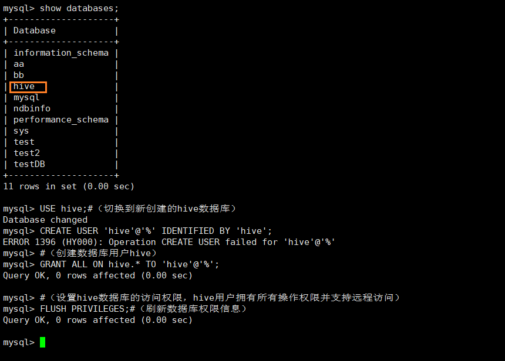

- 从此步往后面Hive安装过程的所有操作步骤都需要使用**admin**用户进行。
- 后面步骤只在集群中**Cluster-01**主机上进行操作即可

```shell
vi ~/hive/apache-hive-2.1.1-bin/conf/hive-site.xml
#添加MySQL连接的相关配置信息
```

找到下列标签`<name>`所标识的属性项名称所在位置，修改其标签`<value>`所标识的属性值部分的内容：

```xml
<configuration>
    <!--指定Hive的日志文件目录，需要是位于HDFS上的目录-->
    <property><name>javax.jdo.option.ConnectionURL</name>
        <value>jdbc:mysql://LZY-04:3306/hive?createDatabaseIfNotExist=true&amp;characterEncoding=UTF-8&amp;useSSL=false</value>
    </property>
    <property>   
        <name>javax.jdo.option.ConnectionDriverName</name>
        <value>com.mysql.jdbc.Driver</value></property>
    <property>
        <name>javax.jdo.option.ConnectionUserName</name>
        <value>hive</value>
    </property>
    <property>
        <name>javax.jdo.option.ConnectionPassword</name>
        <value>hive</value>
    </property>
</configuration>

```

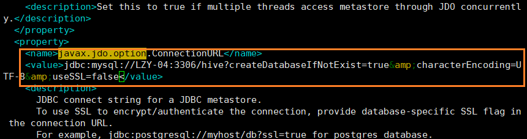

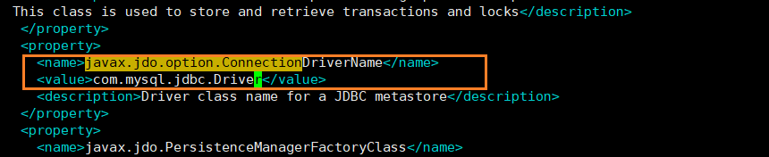

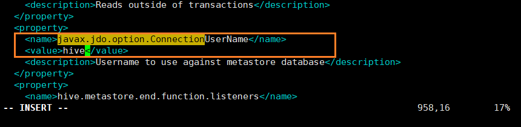


MySQL的数据库连接工具包`mysql-connector-java-5.1.42-bin.jar`我们已经上传到admin用户家目录的`setups`目录下，该目录为事先自行创建,并将实训相关软件包从优盘拷贝至该目录下。

```shell
cp -v ~/setups/mysql-connector-java-5.1.42-bin.jar ~/hive/apache-hive-2.1.1-bin/lib
#将MySQL的数据库连接工具包添加到Hive的`lib`目录下
```

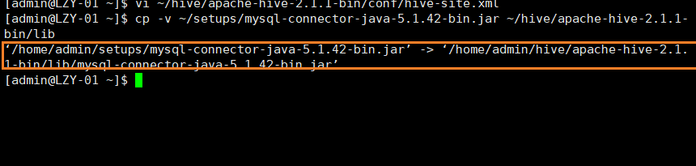

```shell
vi ~/hive/apache-hive-2.1.1-bin/conf/hive-site.xml
#添加MySQL连接的相关配置信息
```


在编辑器中使用快捷键`:`进入到编辑器的命令模式，也称为末行模式，然后使用命令

```
%s#${system:java.io.tmpdir}#/home/admin/hive/tmp#g
%s#${system:user.name}#${user.name}#g
```

替换掉配置文件中的原有配置内容。保存退出。

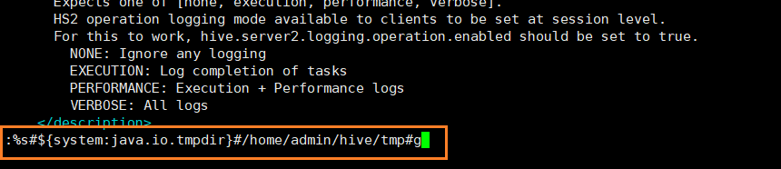

```shell
schematool -initSchema -dbType mysql
#对Hive进行初始化。

```

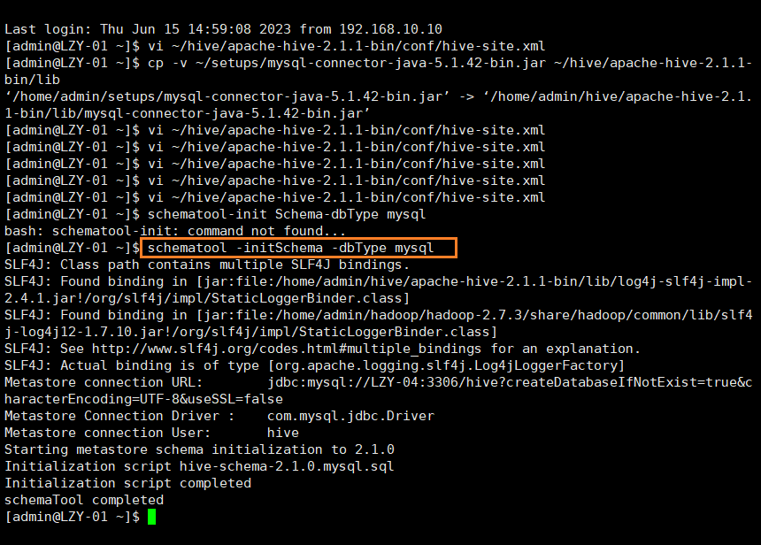

## Hive工具启动和验证

- Hive安装过程的所有操作步骤都需要使用**admin**用户进行。-
- 本项步骤只在集群中**Cluster-01**主机上进行操作即可。

1. 使用命令`hive`启动Hive，启动成功后能够进入Hive的控制台。
2. 在控制台中使用命令`show databases;`查看当前的数据库列表。
3. 在控制台中使用命令`show functions;`查看Hive的功能函数。
4. 在控制台中使用命令`desc function sum;`或`desc function extended sum;`查看Hive的功能函数的详细信息。
5. 在控制台中使用命令`quit;`或`exit;`退出Hive的控制台

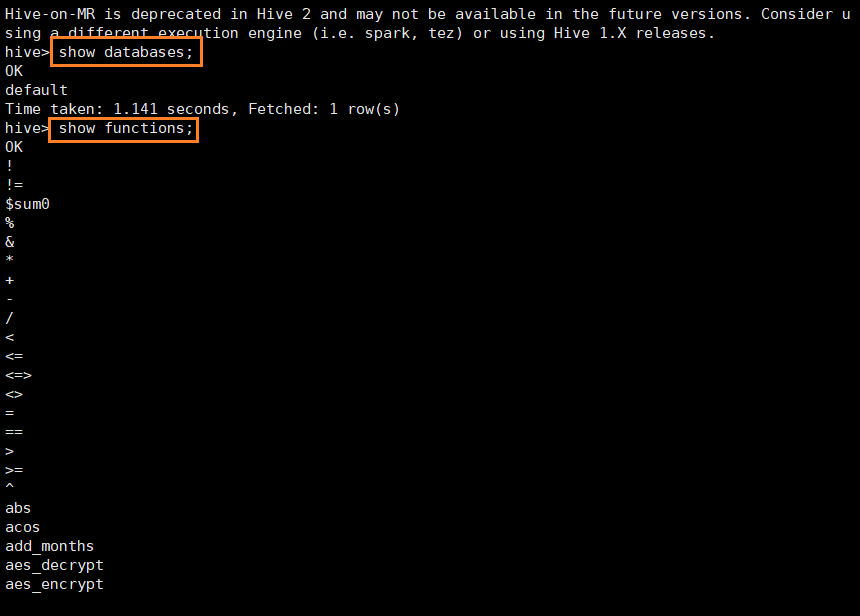


### 关闭

关闭顺序:
SQL节点->数据节点->管理节点

在SQL服务节点执行:

```shell
service mysql stop
```

在管理节点执行:

```shell
ndb_mgm -e shutdown
```

