## Zookeeper基本安装配置

首先，Zookeeper软件包`zookeeper-3.4.9.tar.gz`我们上节课已经上传到用户家目录的`setups`目录下。然后进行解压和环境变量设置。命令:

```shell
mkdir ~/zookeeper
#创建用于存放Zookeeper相关文件的目录
cd ~/zookeeper
#进入该目录
tar -xzf ~/setups/zookeeper-3.4.9.tar.gz
#将软件包解压
```


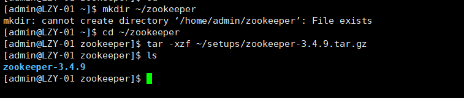


```shell
vi ~/.bash_profile
#配置Zookeeper相关的环境变量
```

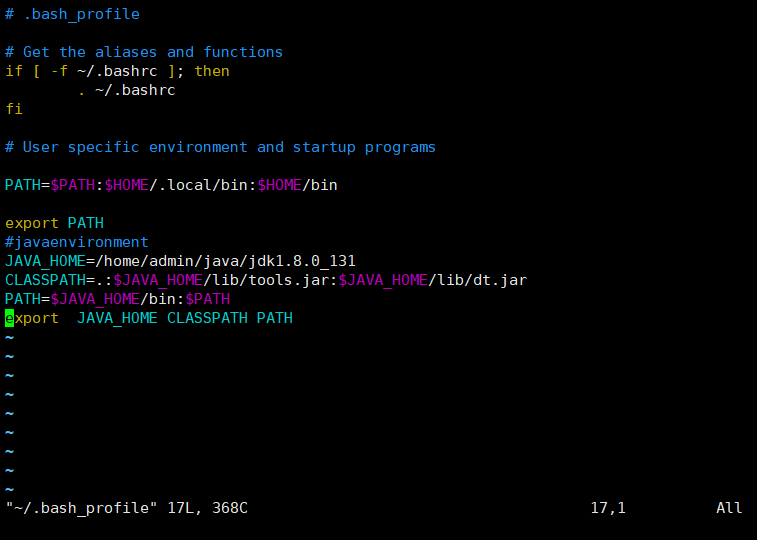


对配置文件进行修改，在文件末尾添加以下内容:

```shell
#zookeeper environment
#该路径以Zookeeper软件包实际解压解包的路径为准
ZOOKEEPER_HOME=/home/admin/zookeeper/zookeeper-3.4.9

#确保此项输入正确，否则可能会导致所有命令无法使用
PATH=$ZOOKEEPER_HOME/bin:$PATH

export ZOOKEEPER_HOME PATH
#必须按照前面的定义顺序书写
```


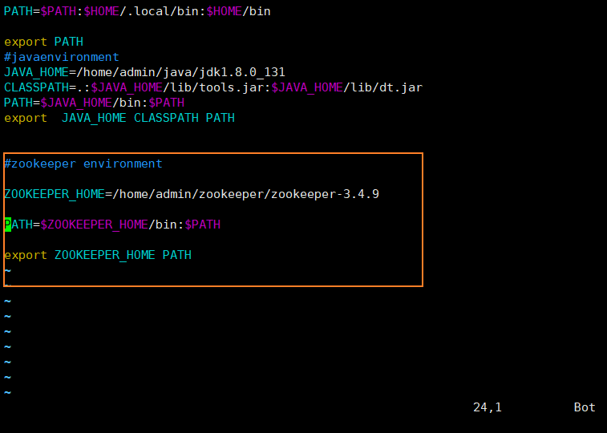


```shell
source ~/.bash_profile
#使新配置的环境变量立即生效
echo $ZOOKEEPER_HOME
#查看新添加和修改的环境变量是否
echo $PATH
#设置成功，以及环境变量的值是否正确。
```

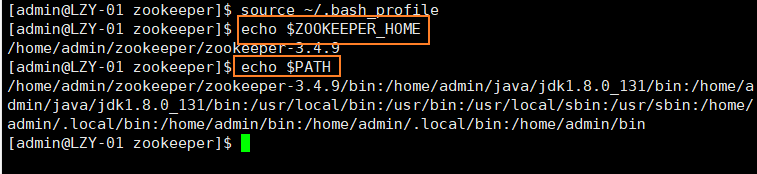


## Zookeeper完全分布模式配置

```shell
cd ~/zookeeper
#进入Zookeeper相关文件的目录
mkdir data logs
#分别创建用于存放数据文件的目录“data”和用于存放日志文件的目录“logs”。
cd ~/zookeeper/zookeeper-3.4.9/conf
#进入Zookeeper的配置文件所在目录
cp zoo_sample.cfg zoo.cfg
#考贝生成Zookeeper的配置文件
```

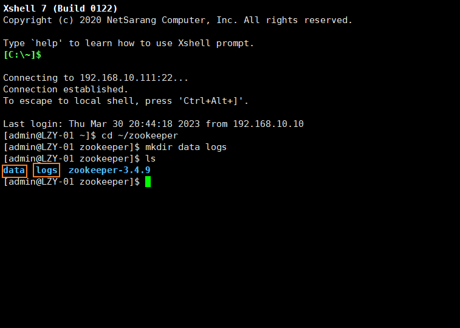

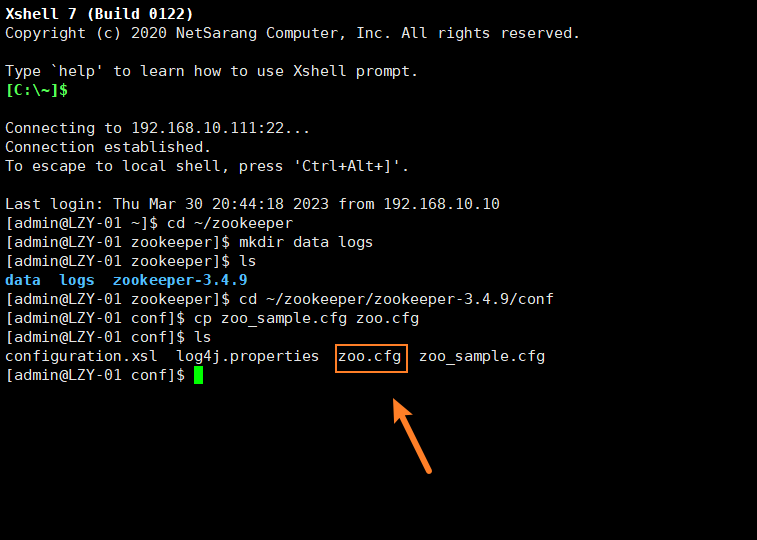


```shell
vi zoo.cfg
#对配置文件进行修改
```

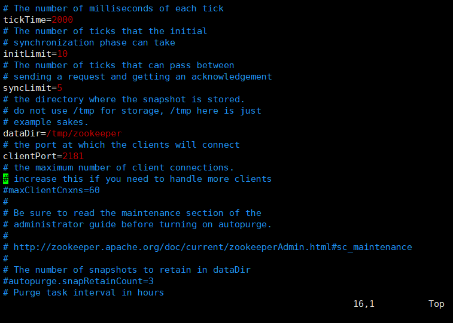

```shell
#以下配置项若已经存在则修改其对应值，若不存在则在配置文件末尾进行添加:
dataDir=/home/admin/zookeeper/data
dataLogDir=/home/admin/zookeeper/logs
server.1=LZY-01:2888:3888
server.2=LZY-02:2888:3888
server.3=LZY-03:2888:3888
server.4=LZY-04:2888:3888
server.5=LZY-05:2888:3888
```

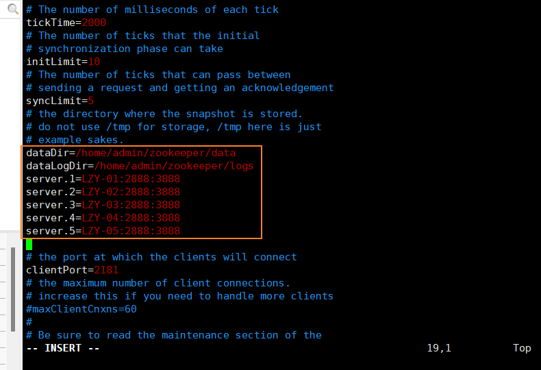


## 同步安装和配置

将`zookeeper`目录和`.bash_profile`文件发给集群中所有主机

发送目标用户为集群专用用户**admin**

发送目标路径为`/home/admin`，即集群专用用户**admin**的家目录

```shell
scp -r ~/zookeeper ~/.bash_profile admin@LZY-02:/home/admin
scp -r ~/zookeeper ~/.bash_profile admin@LZY-03:/home/admin
scp -r ~/zookeeper ~/.bash_profile admin@LZY-04:/home/admin
scp -r ~/zookeeper ~/.bash_profile admin@LZY-05:/home/admin
```

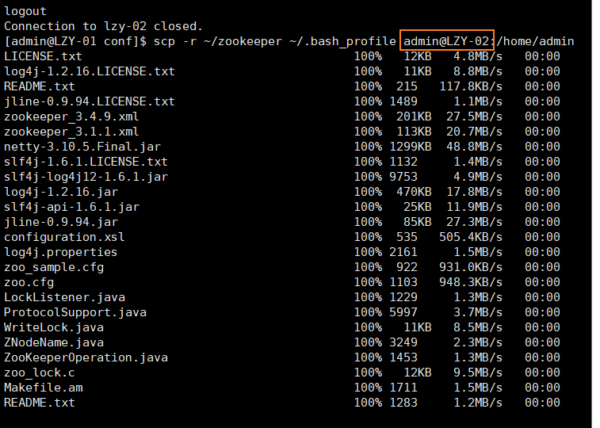

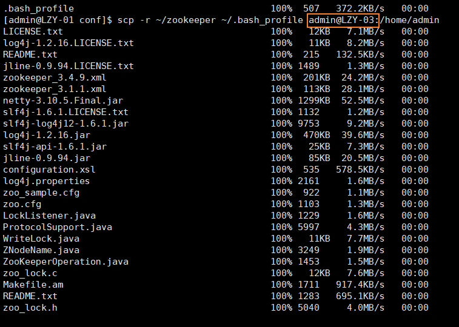


然后每台执行`source ~/.bash_profile`使环境变量生效

```she
source ~/.bash_profile
```

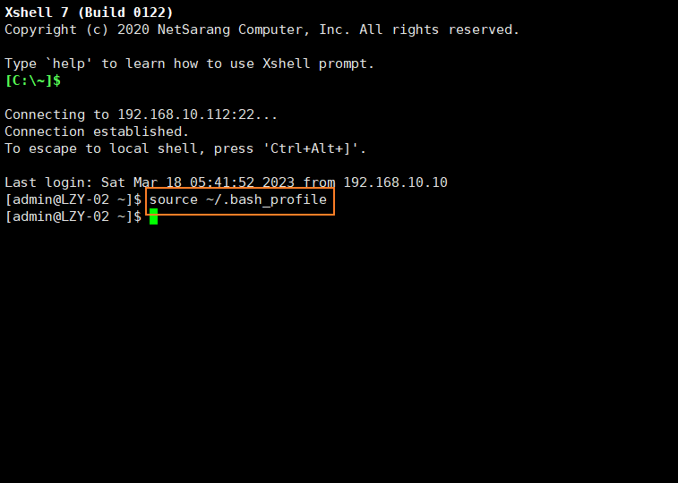

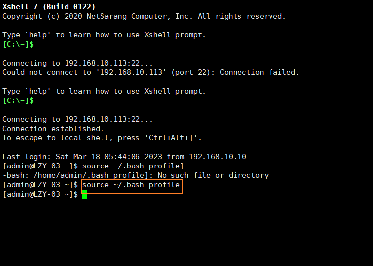

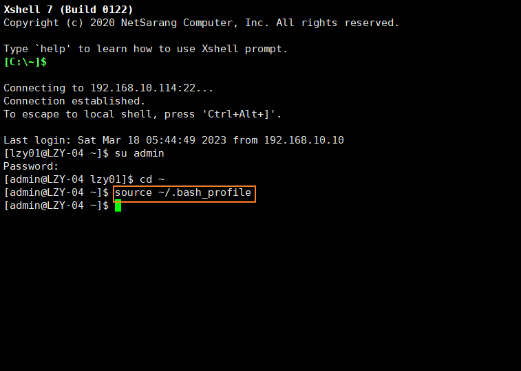

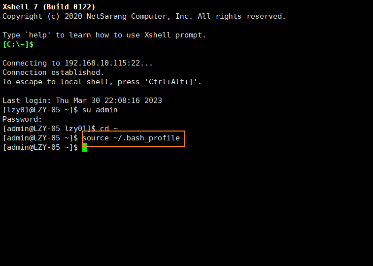


在每台主机或虚拟机上，使用命令
`echo $ZOOKEEPER_HOME、echo $PATH`查看新添加和修改的环境变量是否设置成功，以及环境变量的值是否正确。

```shell
echo $ZOOKEEPER_HOME
echo $PATH
```

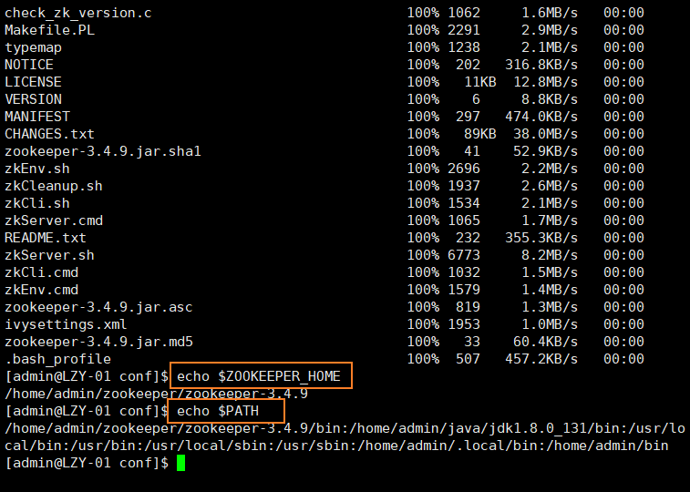

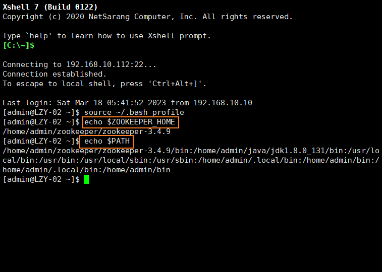

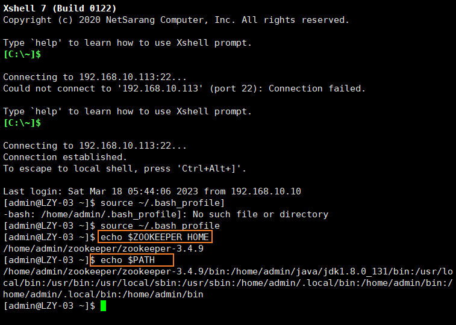

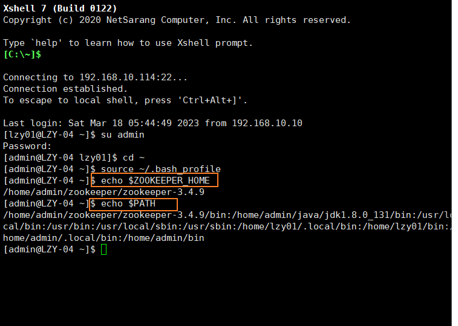

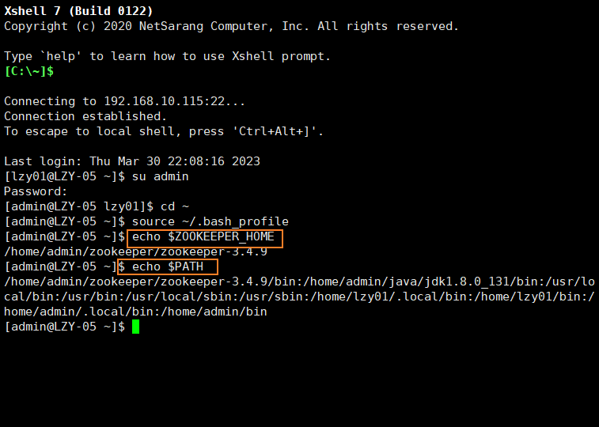


## 配置Zookeeper节点标识文件

在集群中所有主机上使用命令`echo '*' > ~/zookeeper/data/myid`创建**Zookeeper**的节点标识文件，其中 ` *` 为节点的编号，与配置文件`server.*=LZY-01:2888:3888`中`server.*`中的 `*` 相对应。
命令:

```shell
echo '1' > ~/zookeeper/data/myid

echo '2' > ~/zookeeper/data/myid

echo '3' > ~/zookeeper/data/myid

echo '4' > ~/zookeeper/data/myid

echo '5' > ~/zookeeper/data/myid
 #注意这里的单引号格式
```


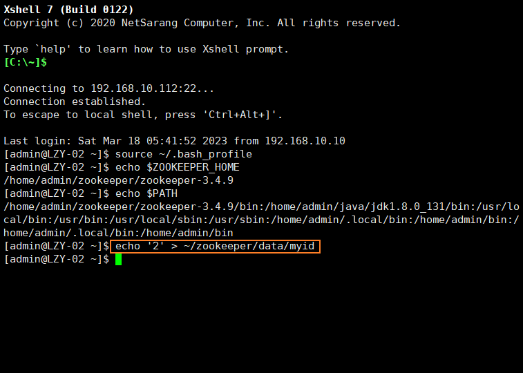


## Zookeeper完全分布模式启动和验证

进行操作前，先关闭防火墙（**root**用户下):

```shell
 systemctl stop firewalld.service
 systemctl disable firewalld.service
```

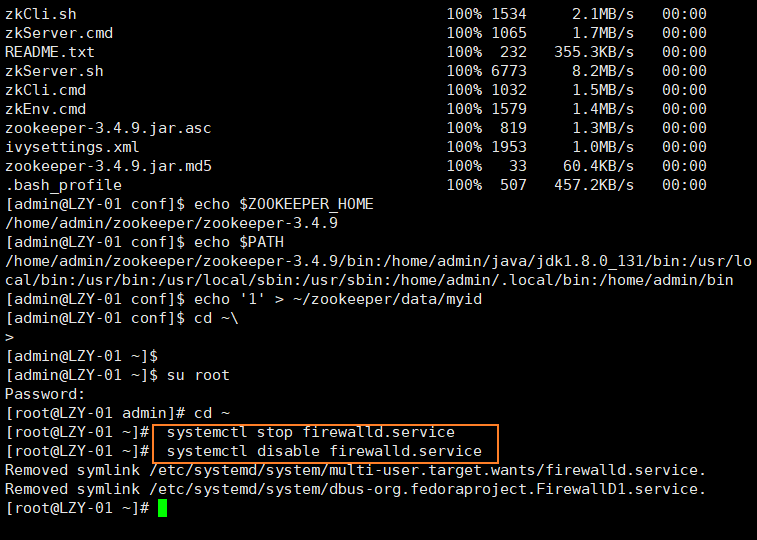


在集群中所有主机上使用命令`zkServer.sh start`启动**Zookeeper**服务的脚本，若启动过程没有报错，并且显示`STARTED`则表示启动成功。

```shell
zkServer.sh start
```

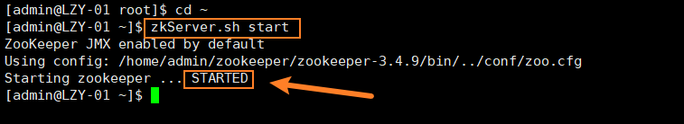

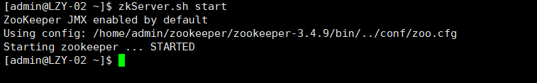

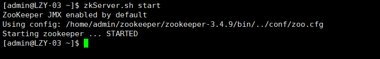


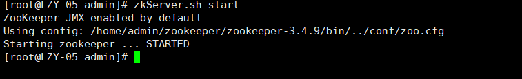


在集群中所有主机上使用命令`jps`查看**Java**进程信息，若存在一个名为`QuorumPeerMain`的进程，则表示**Zookeeper**服务启动成功。

```shell 
jps
```

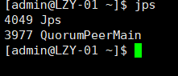

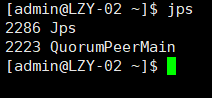

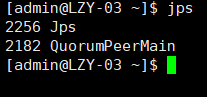

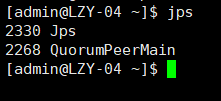

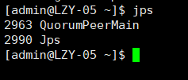


在集群中所有主机上使用命令`zkServer.sh status`查看该节点**Zookeeper**服务当前的状态，若集群中只有一个**“leader”**节点，其余的均为**“follower”**节点，则集群的工作状态正常。防火墙必须关掉。如果防火墙未关闭，状态是**Error contacting service. It is probablynot running.**。

```shell
zkServer.sh status
```

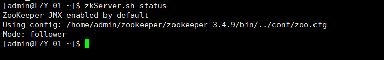


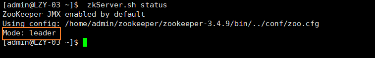

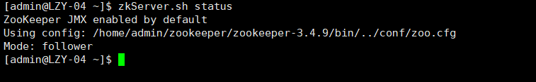

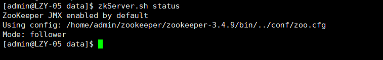


使用命令`zkCli.sh -server LZY-*:2181`利用**Zookeeper**的命令行工具连接**Zookeeper**集群，其中 `*` 为集群中节点的编号，可以选择连接集群中的任意一个节点，若显示“**CONNECTED”**则表示连接正常，命令行工具可以正常使用，在命令行工具中使用命令**“quit”**可以退出工具程序。

```shell
zkCli.sh -server LZY-01:2181

zkCli.sh -server LZY-02:2181

zkCli.sh -server LZY-03:2181

zkCli.sh -server LZY-04:2181

zkCli.sh -server LZY-05:2181
```

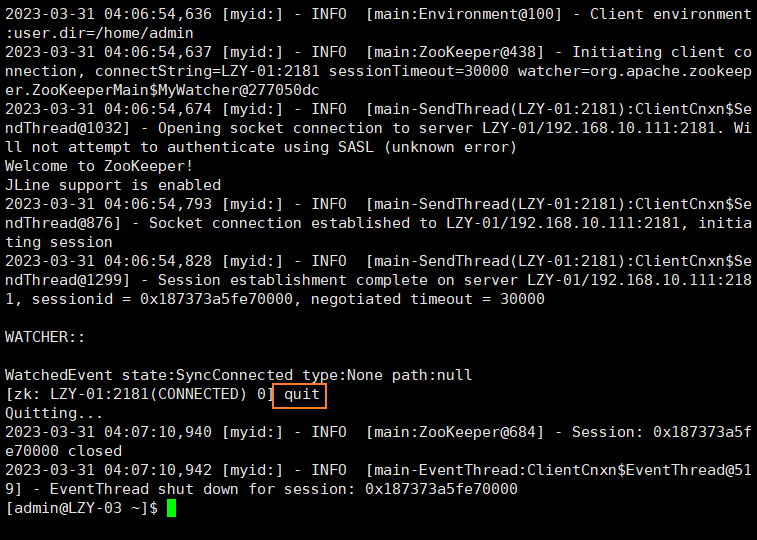

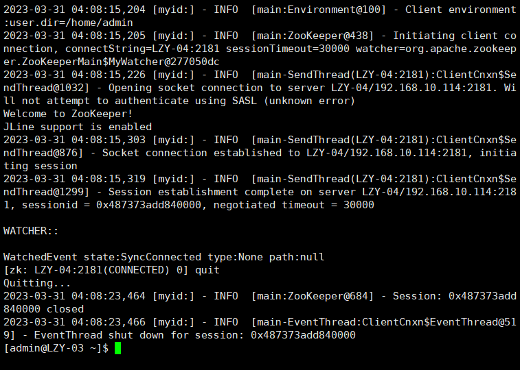
