## 免密登录配置

**关闭防火墙**

```shell
systemctl stop firewalld.service #关闭防火墙服务

systemctl disable firewalld.service#禁止防火墙开机自启动

systemctl status firewalld.service #验证是否关闭
```


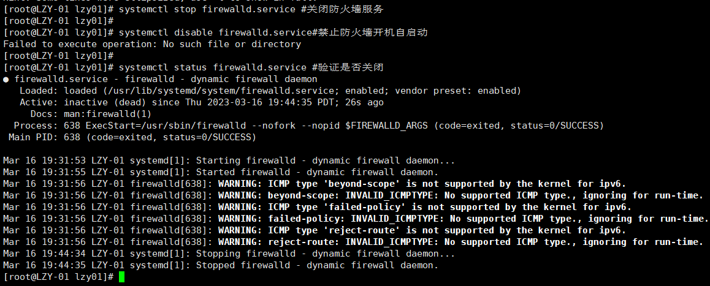

> cd /etc/
>
> vi hosts

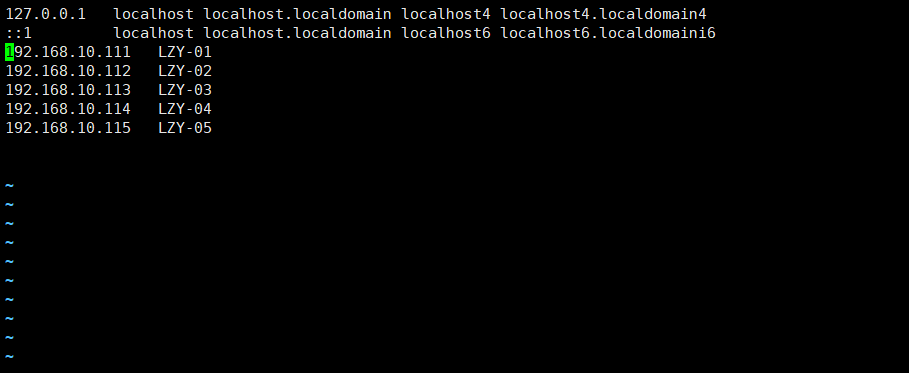

> 192.168.10.111   LZY-01
>
> 192.168.10.112   LZY-02
>
> 192.168.10.113   LZY-03
>
> 192.168.10.114   LZY-04
>
> 192.168.10.115   LZY-05


**复制文件给其他主机**

>scp -r /etc/hosts root@192.168.10.111:/etc
>
>scp -r /etc/hosts root@192.168.10.112:/etc
>
>scp -r /etc/hosts root@192.168.10.113:/etc
>
>scp -r /etc/hosts root@192.168.10.114:/etc
>
>scp -r /etc/hosts root@192.168.10.115:/etc

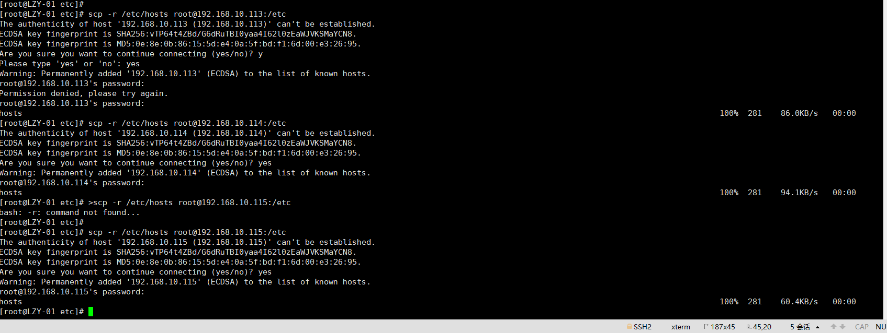

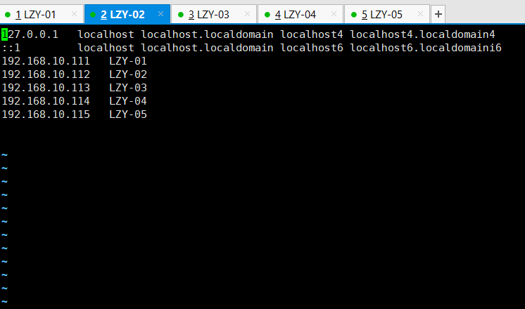


**创建用户**

>adduser admin
>
>passwd admin 
>
>\#新建用于集群的admin用户，每台主机都建一个

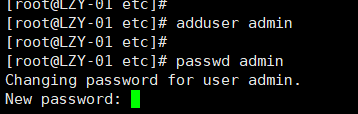

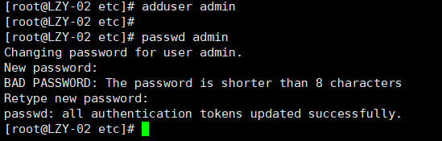

### 生成公钥和私钥文件

>ssh-keygen -t rsa #生成本机系统当前登录用户的公钥和私钥文件

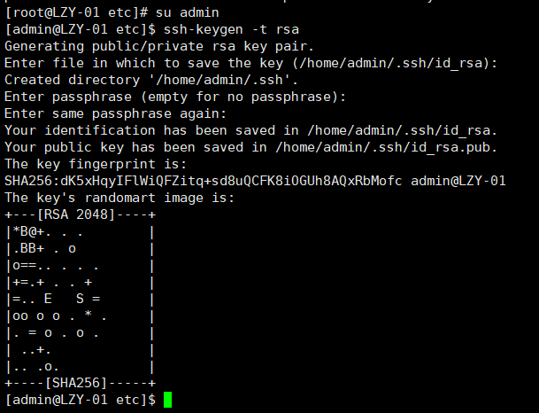

**将文件发送给其他主机**

```shell
ssh-copy-id -i  ~/.ssh/id_rsa.pub admin@LZY-01

ssh-copy-id -i  ~/.ssh/id_rsa.pub admin@LZY-02

ssh-copy-id -i  ~/.ssh/id_rsa.pub admin@LZY-03

ssh-copy-id -i  ~/.ssh/id_rsa.pub admin@LZY-04

ssh-copy-id -i  ~/.ssh/id_rsa.pub admin@LZY-05
```


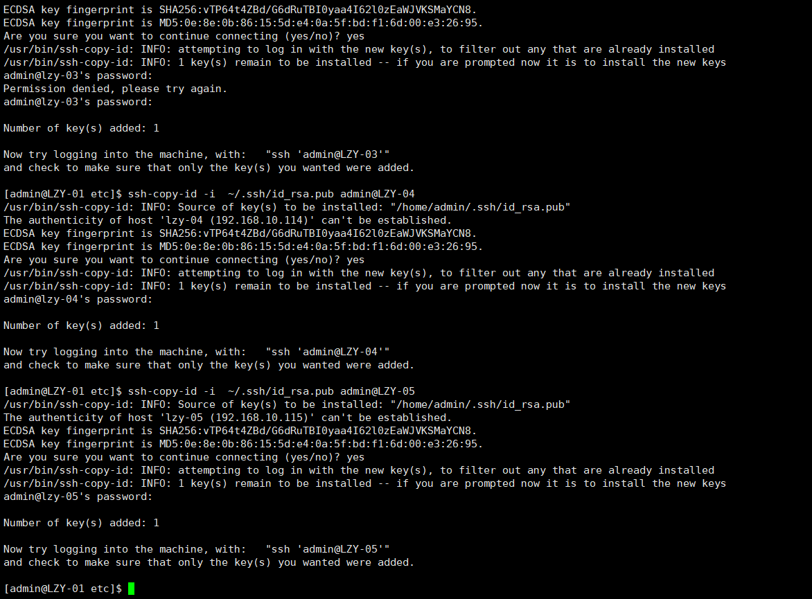


### 验证免密登录

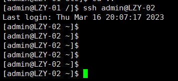

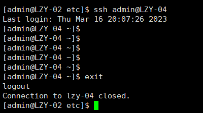


## JDK安装


### 卸载原有JDK

>rpm -qa | grep java
>#搜索所有当前系统中已经安装的JDK相关软件包，主要针对系统自带的和使用rpm安装包安装的情况;通过编译包直接部署的免安装版是搜索不到的，可以查询环境变量删除相应配置和目录即可。


>yum remove tzdata-java-2017b-1.el7.noarch
>yum remove python-javapackages-3.4.1-11.el7.noarch

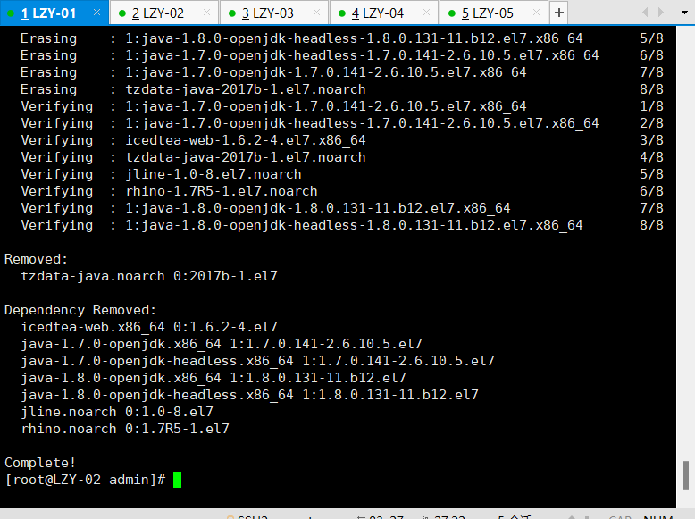


```shell
rpm -qa|grep jdk

rpm -e copy-jdk-configs-2.2-3.el7.noarch
```


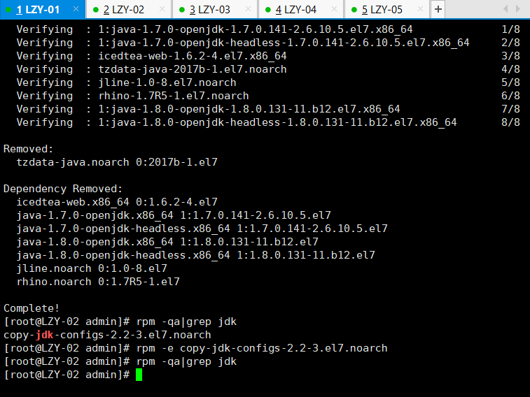


```shell
rpm -e 软件包名

#依次删除所有之前搜索到的当前系统中已经安装的JDK相关软件包

yum remov 软件名

#删除相关联的依赖软件包
```


**重新加载**

```shell
source ~/.bash_profile
```


### 安装配置JDK

首先，我们先新建一个存放Hadoop软件包的文件夹setups,然后把所有相关包上传到setups目录内。

> mkdir ~/setups

在admin用户家目录下创建一个存放软件包的文件夹;

**将相关安装包上传至文件夹**

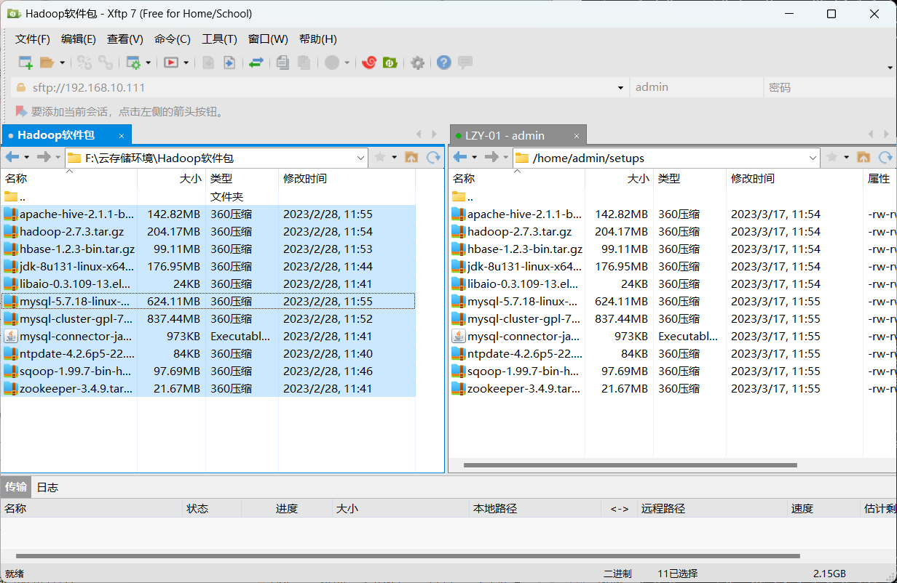

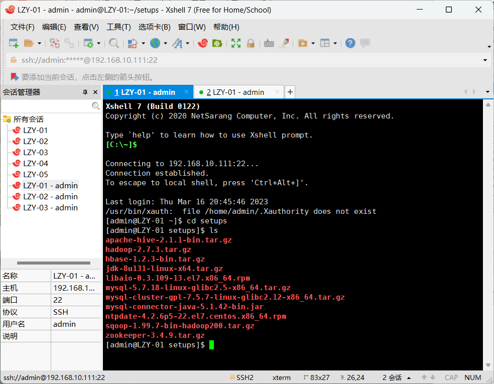


#### 安装

```shell
mkdir ~/java
#在家目录下创建用于存放JDK相关文件的目录
cd ~/java
#进入该目录
tar -xzf ~/setups/jdk-8u131-linux-x64.tar.gz
#将软件包解压解包到“java”目录下
```


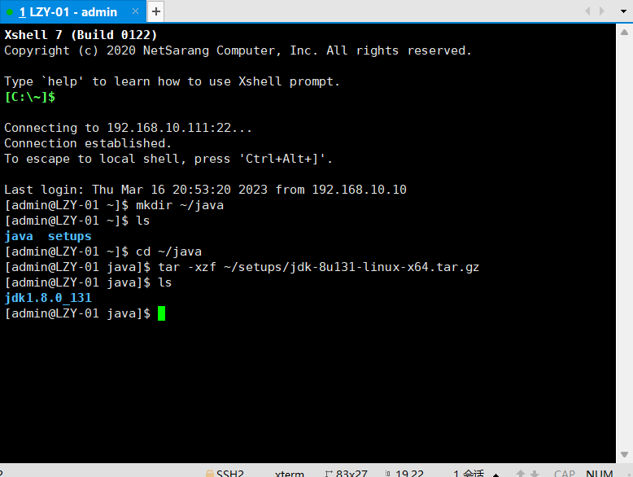


``` shell
vi ~/.bash_profile
```


#### 配置环境变量

```shell
#javaenvironment
JAVA_HOME=/home/admin/java/jdk1.8.0_131
CLASSPATH=.:$JAVA_HOME/lib/tools.jar:$JAVA_HOME/lib/dt.jar
PATH=$JAVA_HOME/bin:$PATH
export  JAVA_HOME CLASSPATH PATH

#该路径以JDK软件包实际解压解包的路径为准

#保证此项输入正确，否则可能会导致所有命令无法使用

#必须按照前面的定义顺序书
```


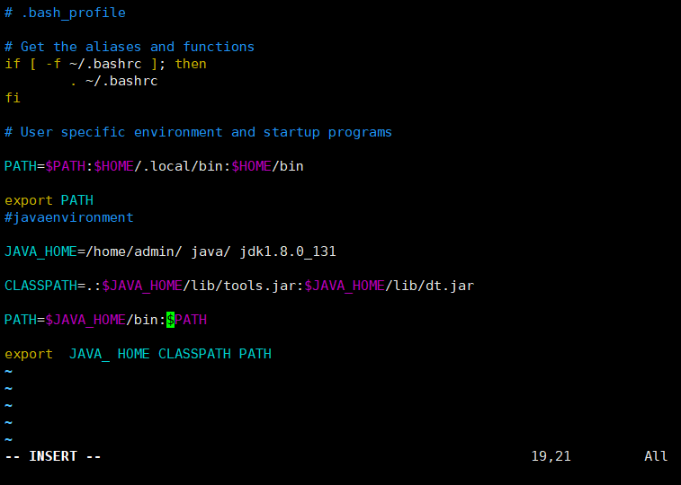

> source ~/.bash_profile
>
> \#使新配置的环境变量立即生效


```shell
echo $JAVA_HOME
echo $CLASSPATH
echo $PATH

#查看新添加和修改的环境变量是否设置成功，以及环境变量的值是否正确。
```

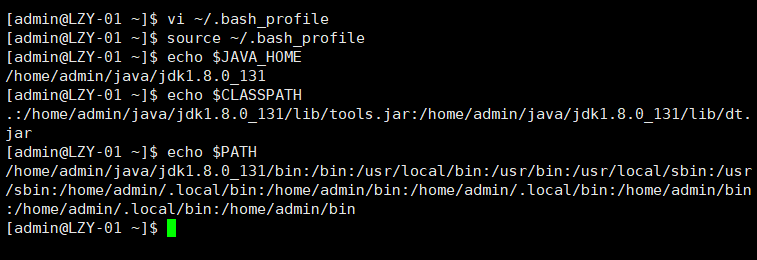


> java -version
> #验证JDK的安装配置是否成功
> javac -version

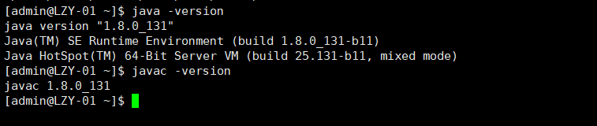


### 同步JDK安装与配置

将`java`目录和`.bash_profile`文件发给集群中所有其它主机，发送目标用户为集群专用用户`admin`，发送目标路径为`/home/admin`即集群专用用户`admin`的家目录。然后每台执行`source ~/.bash profile`使环境变量生效。

```shell
scp -r ~/java ~/.bash profile admin@LZY-02:/home/admin
source ~/.bash_profile
```

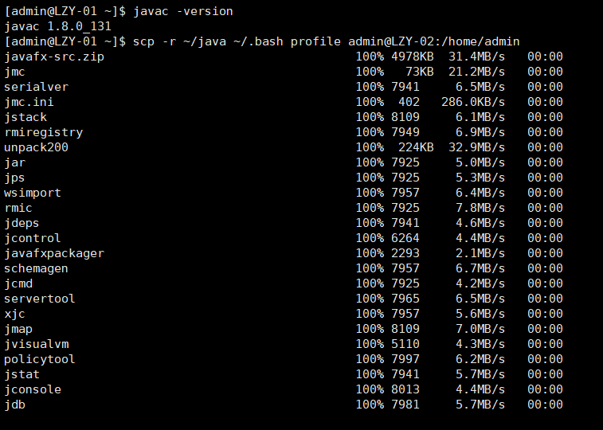


#### 验证

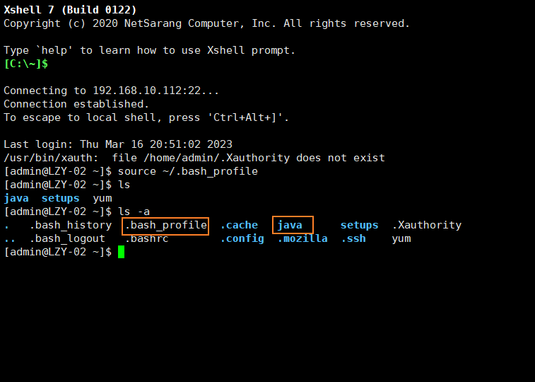

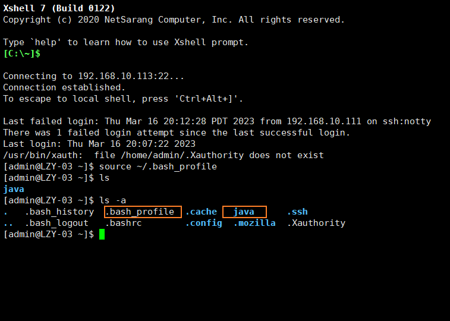


免密登录配置完成，JDK安装配置完成

JDK完成