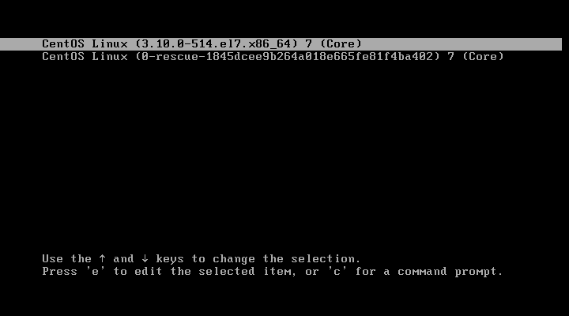
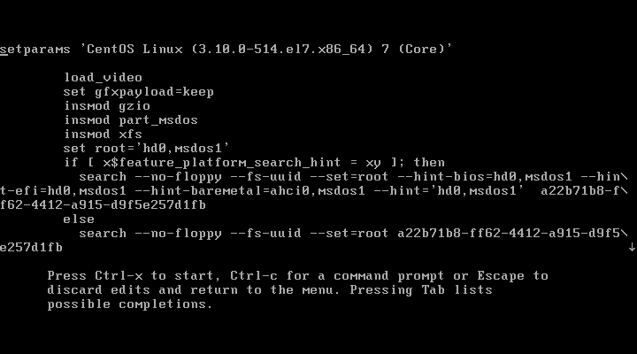
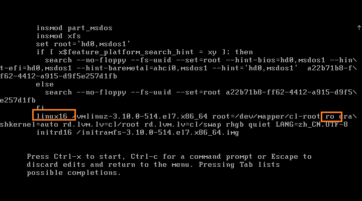
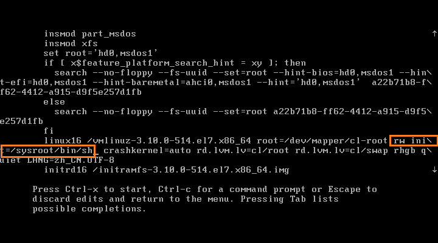
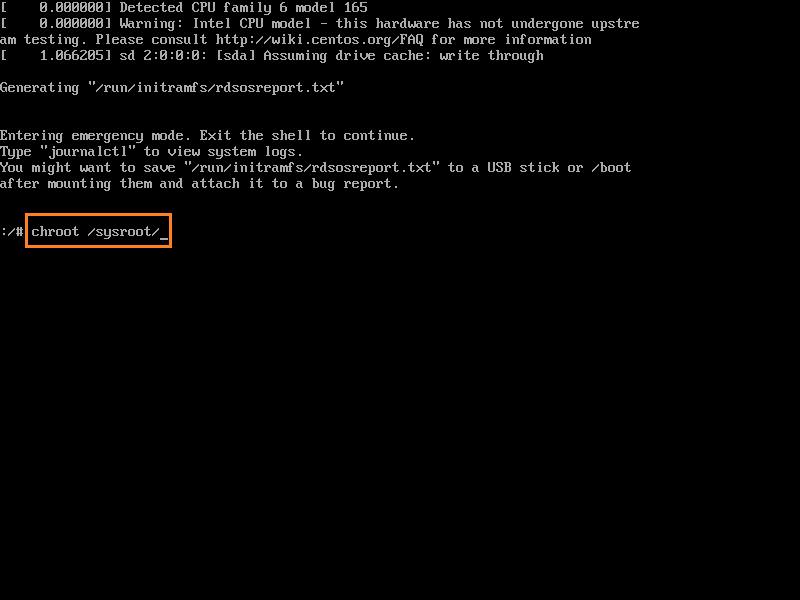
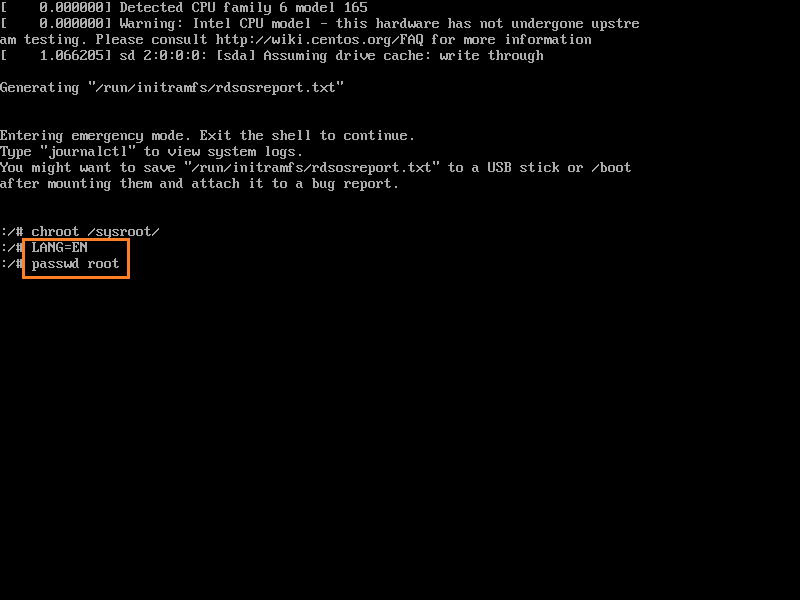
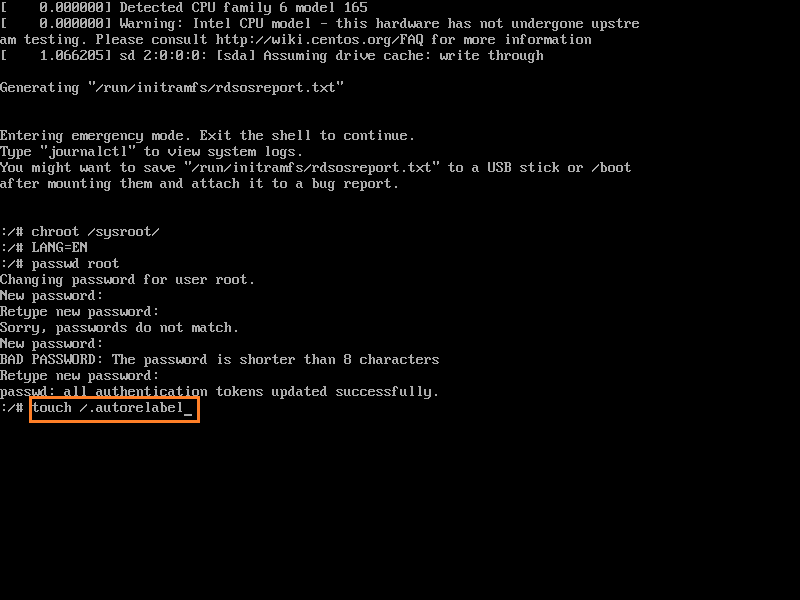

## 通过单用户模式修改root密码

开机时按F2进入引导页面

按e进入编辑页面

3、使用键盘上下左右方向键，往下找到`linux16`开头的一行，定位到`ro`(read only)，编辑`ro`为`rw`(read write)，并在其后写入`init=/sysroot/bin/sh`

然后按照提示按`Ctrl`加`x`键启动。

进入单用户模式，并使用`chroot /sysroot/`命令进入系统root用户下

设置输入英语并修改root密码
切记，输入`touch /.autorelabel`命令，否则系统可能无法正常重启。

重新启动后验证l旧密码失效新密码生效