## Nmap安装与扫描基础

**安装好Nmap**

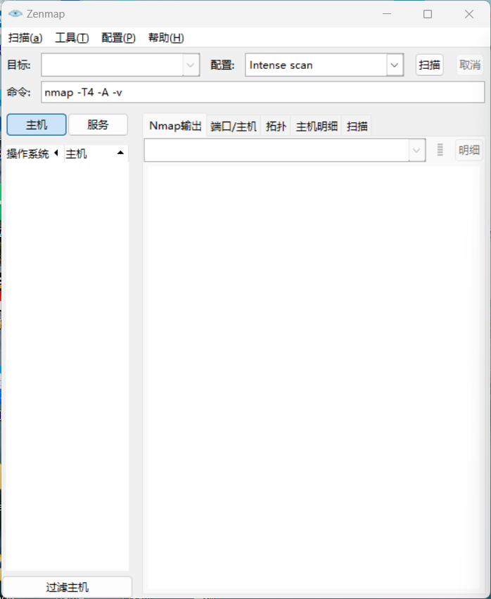

**扫描主机**

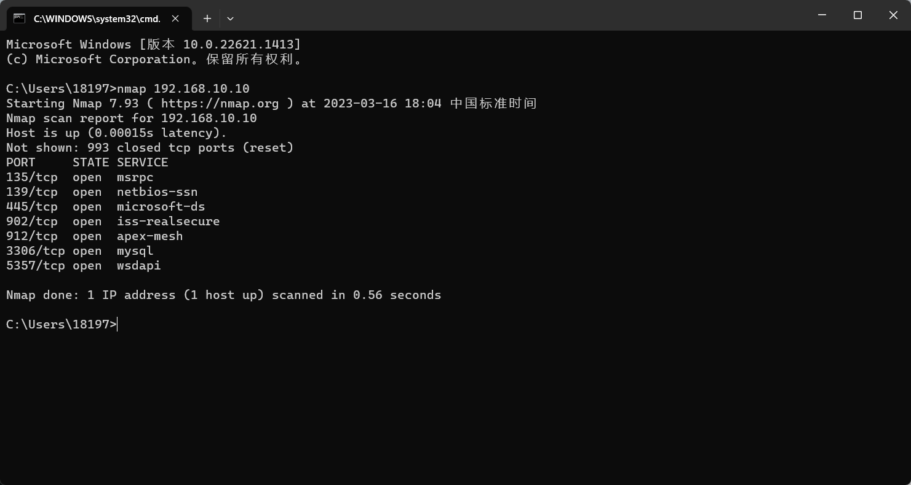

**扫描虚拟机**

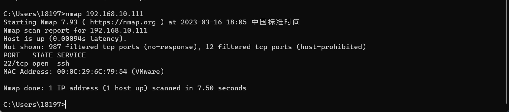

**扫描整个子网**

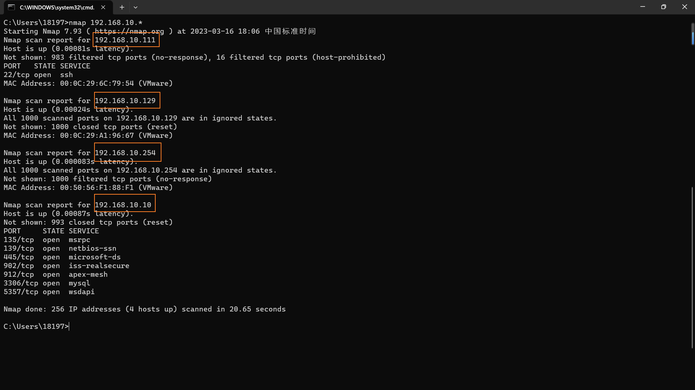

**扫描所有主机，并确定系统类型**

`namp -sS -O ip`

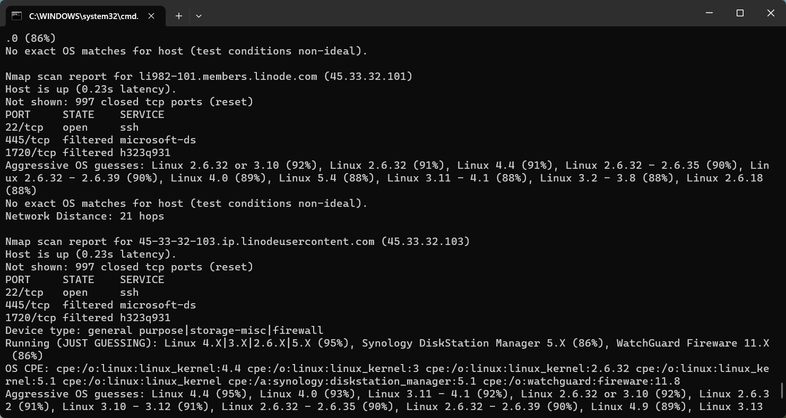

**随机选择任意10台主机检查80端口是否运行**

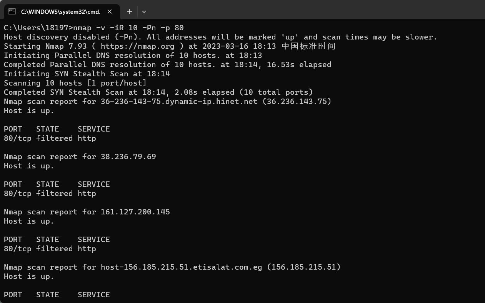

## 选择和排除扫描目标

**用-iR随机扫描3台主机**

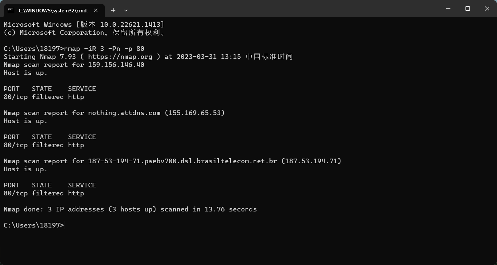

**扫描192.168.1.0/24网段的主机但排除192.168.1.11**

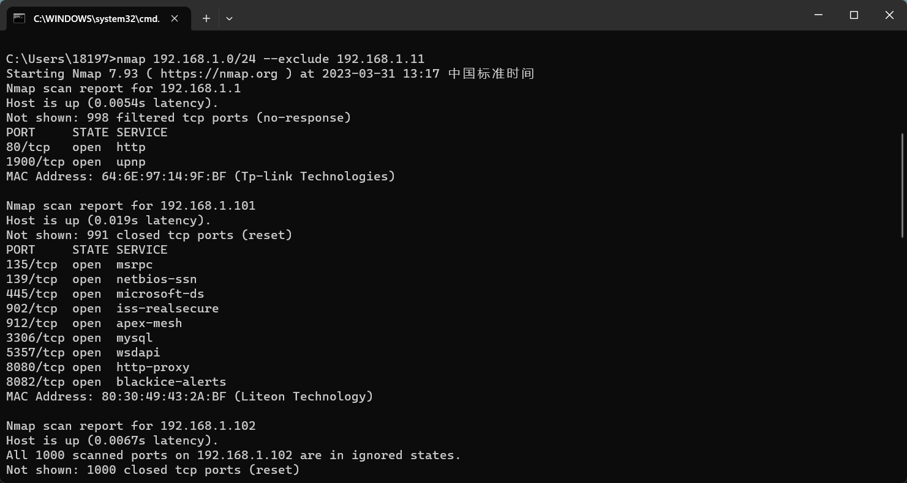

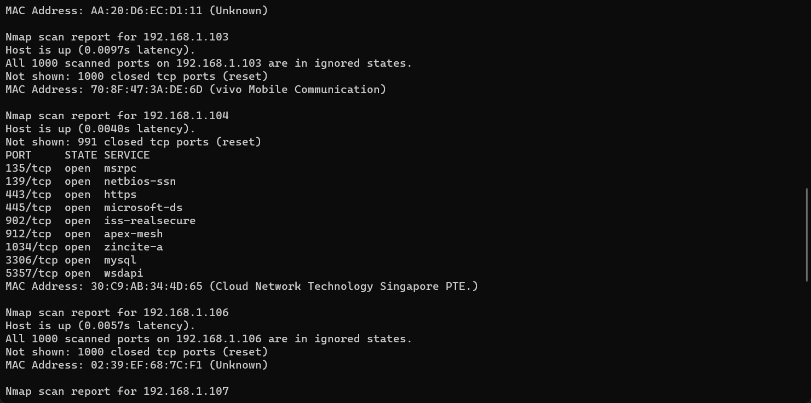

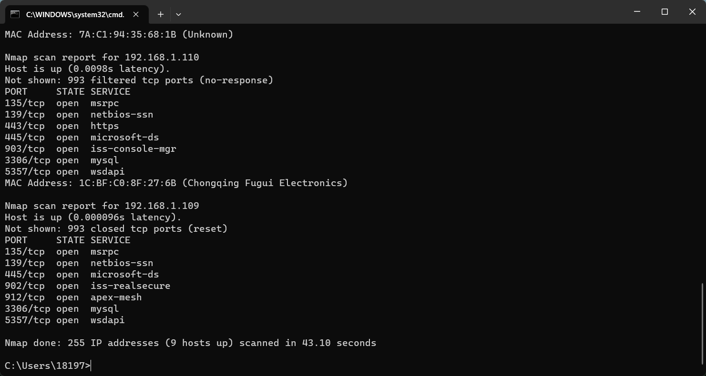

## 扫描发现存活的目标主机

**用-sL在网络上扫描nesst.com域的主机**

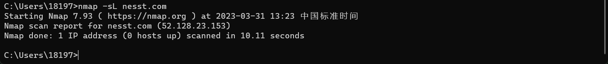

**用-sn参数发现网络中192.168.1.1-20 的20台主机中存活主机**

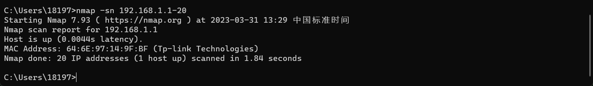

**-Pn参数将所有指定的主机视为开启状态，跳过主机发现的过程，直接报告端口开放情况**

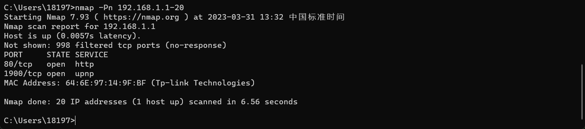

**组合参数探测**

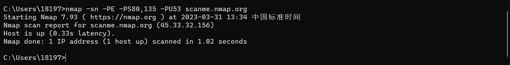

## 识别目标操作系统

**使用nmap -O目标主机地址来探测操作系统类型**

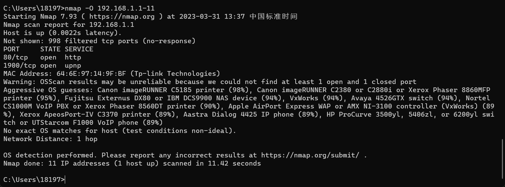

**使用namp -O --osscan-guess目标主机地址来猜测操作系统类型**

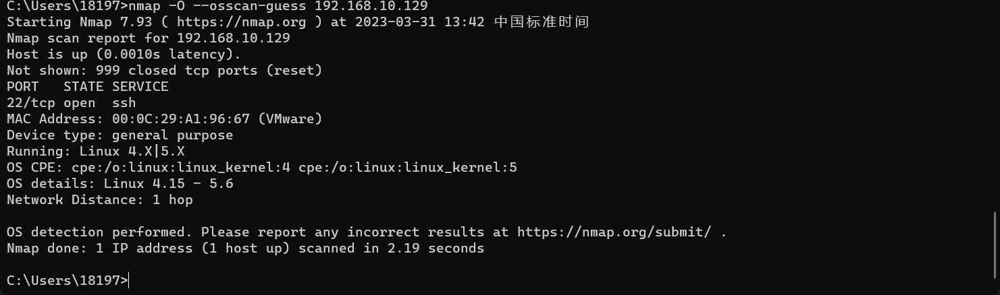

## 识别目标主机的服务及版本

**使用-sV进行基本版本扫描**

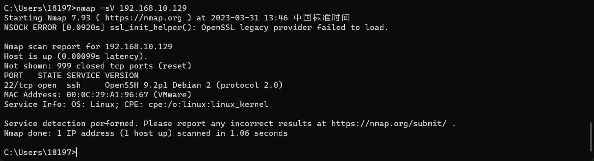

**详尽的列出探测过程**

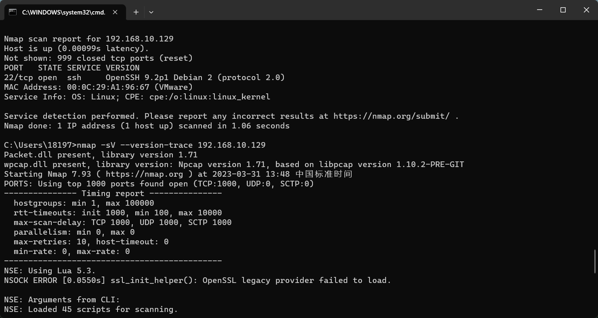

**轻量级探测**

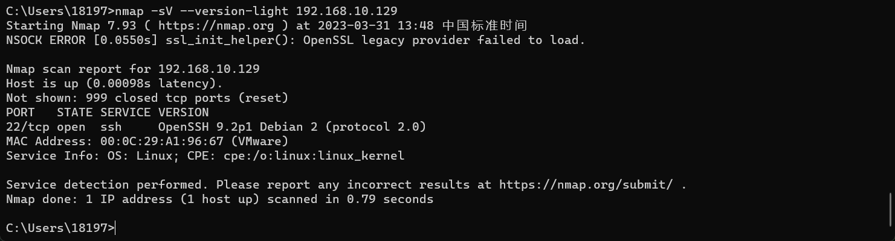

**尝试使用所有probes探测**

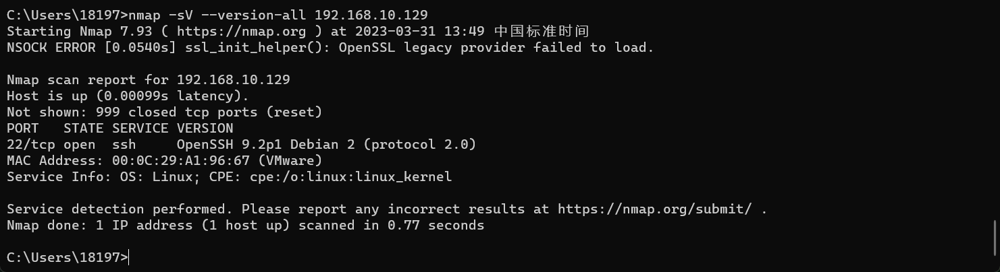